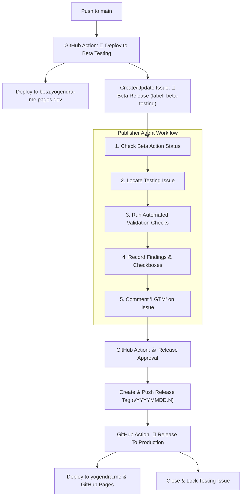

# Release Publisher & Beta Verification Runbook

Use this skill whenever a post or feature has been pushed to `main` and needs end-to-end verification, quality checks on the Beta staging site, issue tracking update, and approval for production release.

---

## The Release Lifecycle



---

## Automated Execution (Recommended)

Run the automated verification and approval script:

```bash
# Run sanity checks, record findings, and approve with LGTM
python3 .agents/skills/publisher/scripts/verify_beta.py --approve
```

To run dry-run checks without approving:
```bash
python3 .agents/skills/publisher/scripts/verify_beta.py
```

---

## Step-by-Step Manual Runbook

If executing step-by-step or debugging issues:

### Step 1: Check Latest Beta Workflow Status
Verify that the `🧪 Deploy to Beta Testing` workflow finished successfully:

```bash
gh run list --workflow="🧪 Deploy to Beta Testing" --limit 1
```
Expected output: Status `✓ completed` and Conclusion `success`.

---

### Step 2: Locate the Open Testing Issue
Find the active release testing ticket:

```bash
gh issue list --label beta-testing --state open --limit 1
```

Extract the issue number (`#<ISSUE_NUMBER>`) and details:
```bash
gh issue view <ISSUE_NUMBER>
```

---

### Step 3: Run Validation Checks on Beta Site
Test the beta deployment (`https://beta.yogendra-me.pages.dev/`):

1. **Homepage & Responsive Layout**:
   - HTTP 200 status code.
   - Title tag and `<meta name="viewport" ...>` present.
2. **New / Changed Articles**:
   - URL resolves with HTTP 200.
   - Frontmatter (`title`, `tags`, `categories`, `date`) properly rendered.
   - Mermaid diagrams (`<pre class="mermaid">`) and code blocks properly formatted.
3. **Core Site Navigation**:
   - `/projects/`, `/about/`, `/events/` all return HTTP 200.

---

### Step 4: Record Findings & Approve in Single Issue Comment

Update the checklist in the issue description and post the consolidated validation summary with approval:

```bash
# 1. Update checklist boxes in issue body
gh issue view <ISSUE_NUMBER> --json body --jq '.body' | \
  sed 's/- \[ \]/- [x]/g' > /tmp/issue_body.md
gh issue edit <ISSUE_NUMBER> --body-file /tmp/issue_body.md

# 2. Record validation table comment with LGTM approval
cat << 'EOF' > /tmp/comment.md
## 🧪 Beta Validation Report

> **Status:** All Checks Passed ✅  
> **Environment:** [https://beta.yogendra-me.pages.dev/](https://beta.yogendra-me.pages.dev/)  
> **Testing Ticket:** #<ISSUE_NUMBER>  

### 📋 Sanity Check Results

| Check | Target URL | Status | Details |
|:---|:---|:---:|:---|
| 🏠 Homepage & Viewport | [`/`](https://beta.yogendra-me.pages.dev/) | `PASS` ✅ | HTTP 200 • Viewport meta & Title verified |
| 🗂️ Navigation: Projects | [`/projects/`](https://beta.yogendra-me.pages.dev/projects/) | `PASS` ✅ | HTTP 200 |
| 🗂️ Navigation: About | [`/about/`](https://beta.yogendra-me.pages.dev/about/) | `PASS` ✅ | HTTP 200 |
| 🗂️ Navigation: Events | [`/events/`](https://beta.yogendra-me.pages.dev/events/) | `PASS` ✅ | HTTP 200 |

---

### 👍 Release Approval

**LGTM** — Automated sanity checks verified. Ready for production release.
EOF

# 3. Post consolidated comment with LGTM approval
gh issue comment <ISSUE_NUMBER> --body-file /tmp/comment.md
```

This triggers the `👍 Release Approval` workflow, which tags the release and launches `🎯 Release To Production`. Once deployed, the action will automatically update, close, and lock the testing issue.

---

### Step 6: Monitor Production Deployment

Watch the `🎯 Release To Production` workflow:

```bash
gh run list --workflow="🎯 Release To Production" --limit 1
```

Once completed:
- The site is live on `https://yogendra.me`.
- The testing ticket is automatically commented on, closed, and locked by `github-actions[bot]`.

---

## Workflow: Deploy (preserved reference)

To deploy the site to **production**:
```
task release:deploy
```

To deploy to **beta/staging**:

```
task beta:deploy
```
