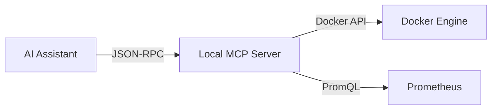

# Technical Blogging & Content Creation Guide

Use this skill when researching, drafting, structuring, illustrating, and publishing technical articles for `yogendra.me`.

---

## 1. Directory & Page Bundle Conventions

All posts live as **Page Bundles** under `content/posts/YYYY/MM/<slug>/`:
```
content/posts/2026/08/building-a-local-mcp-server/
├── index.md        # The article markdown and frontmatter
├── featured.png    # (Optional) Hero / thumbnail image
└── diagram.svg     # (Optional) Static asset or image
```

### Scaffolding a New Post
Always create posts using the task command:
```bash
task post:create -- "Your Post Title Here"
```
This automatically computes the lowercase slug, sets up the date hierarchy, and scaffolds the frontmatter.

---

## 2. Frontmatter Standards

Every post should include structured metadata:

```yaml
---
title: "Building a Local MCP Server for Homelab Automation"
date: 2026-08-20T10:00:00+08:00
draft: true
description: "A practical guide to building and running custom Model Context Protocol (MCP) servers in a Dockerized homelab."
tags:
  - Docker
  - Homelab
  - AI
  - MCP
categories:
  - Engineering
  - Tutorials
series:
  - Homelab AI
author: Yogi
---
```

---

## 3. Article Structure & Best Practices

1. **Hook & Problem Statement**:
   - Start directly with what problem is being solved or what concept is being demystified.
   - Avoid fluff introductions.
2. **Architecture / Mental Model**:
   - Include at least one visual architecture or sequence flow using Mermaid.
3. **Hands-on Implementation**:
   - Provide concrete, copy-pasteable code, configurations, or shell commands.
   - Use language tags for all code fences (e.g. ` ```bash `, ` ```yaml `, ` ```python `).
4. **Key Takeaways & Summary**:
   - Bullet points recapping the core insight or next steps.

---

## 4. Mermaid.js Diagrams

The Clarity theme natively renders Mermaid blocks:

````markdown

````

### Best Practices for Diagrams:
- Use `flowchart LR` (horizontal) or `flowchart TD` (vertical).
- Quote labels containing special characters: `Node["Traefik (v3 Reverse Proxy)"]`.
- Use sequence diagrams for protocols / message exchanges.

---

## 5. Live Staging on Homelab

- **Preview URL**: `https://blog.hs.yogendra.me`
- The homelab staging container automatically watches the repository directory with `--buildDrafts`, `--buildFuture`, and `--poll 700ms`.
- As soon as `index.md` or images are saved, the staging site updates live.

---

## 6. Publishing Checklist

1. Review post formatting and diagram rendering at `https://blog.hs.yogendra.me`.
2. Flip `draft: false` in frontmatter.
3. Commit and push:
   ```bash
   git add content/posts/YYYY/MM/<slug>/
   git commit -m "feat(blog): publish <slug>"
   git push origin main
   ```
4. GitHub Actions CI/CD automatically deploys to `https://yogendra.me` and `https://yogendra.github.io`.
