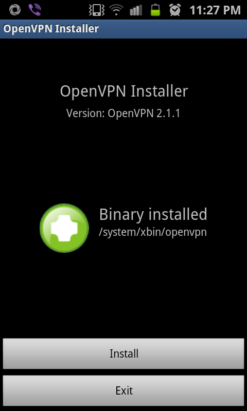

Since mid-last year, I started using a VPN service. Good for me, my VPN provider has both [L2TP](https://goo.gl/8LTMa) and [OpenVPN](https://goo.gl/jEe4k) services. L2TP is very easy to configure on Android phones (newer ones). But I find it unstable (may be my provider's problem). So, I prefer OpenVPN as its stable.

<!--more-->


I can only switch between L2TP and OpenVPN a limited number of time in a month. My provider do provide a good guide for getting OpenVPN up and running on a rooted android phone. But as we know "NO TWO DROIDS ARE SAME", I had to improvise to get it all up. I did manage to get VPN up in a sec but requests were not getting routed via VPN.

After all the reading around at regular places, I got this thing working. Here's how I did it. You would require:

1. tun.ko module for your kernel (Optional as SGS2 should have it build in, I am using DXKL3 firmware. Else try [tun.ko installer](https://goo.gl/g8Rnj) app), if you can not find one and don't feel like compiling one, STOP HERE else read on.
1. Rooted Phone (procedure for SGS2 [here](https://goo.gl/ehSbJ "here"))
1. BusyBox (SGS2 w/ [CF-Root](https://goo.gl/ehSbJ) don't have to do anything, its all burnt in, else use [BusyBox Installer](https://goo.gl/p8Q1z))
1. VPN Account with OpenVPN service (I guess you have one already else just google it)
1. Application: [OpenVPN Installer](https://goo.gl/Xoecp)
1. Application: [OpenVPN Settings](https://goo.gl/W1VeQ)
1. A PC/Mac with [Android SDK](https://goo.gl/2qpr) (adb tool) and [Kies](https://goo.gl/dS1rv) **OR** [Terminal Emulator](https://goo.gl/G9Ids) **OR** [SSHDroid](https://goo.gl/J7agC) application in the phone
1. 30 minutes of time to make all this work.



Once you have rooted your phone, install applications mentioned above as per your preference . Start "OpenVPN Installer" application and click "Install". Choose "**/system/xbin**" location for "**openvpn**". For "**ifconfig/route**" choose "**/system/xbin/bb**" for ifconfig/route.

Now, this is the most tricky part. ifconfig and route commands did not get configured correctly. Then I stumbled on [this thread](https://goo.gl/3BgZE) where people were facing exact same issue. Its a huge thread, so just read post #30 and #34 or better, run following commands (in bold) on PC/Mac:

1. Remount /system are R/W

```shell
adb remount
```

1. Create a symlink of /system/xbin at /system/xbin/bb

```shell
adb  ls -s /system/xbin /system/xbin/bb
```

1. Link toolbox (busybox) as ifconfig and route under /system/xbin/bb

```shell
adb shell ln -s /system/bin/toolbox /system/xbin/bb
adb shell ln -s /system/bin/toolbox /system/xbin/bb
```

1. (Optional) Reboot your phone to just make /system R/O

```shell
adb reboot
```

Puh! congrats you are through with toughest part. Put your OpenVPN configuration files (keys and ovpn file) in **/sdcard/openvpn** folder. Start **OpenVPN Settings**, and you should see your configuration listed just under "**OpenVPN**" option.

Optional: Long press on your configuration name and choose "Preferences". Put Google DNS Server "**8.8.8.8**" in VPN DNS Server field and check "**Use VPN DNS Server**".


All set! Just click on "**OpenVPN**" on main screen and then click on your configuration name (might have to click twice). You will see the progress in the status bar and final message is "**Connection successful**". If you pull the notification bar down, you should see upload and download speeds.

Just go to any site ([ip2location](https://goo.gl/auec)) which tells your ip/location (I go to my VPN provider's page) and check if all works.

Okay I have just enough time to catch next episode of CSI:Miami on CBS. Bye.

_Note:_ For other Android (2.1+) phones checkout [vpnblog](https://goo.gl/UrJMn)
