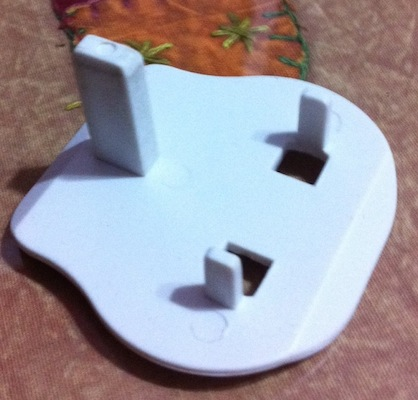

This one is an accidental discovery. I have been always looking for a good phone stand. One  that could hold my phone in a good angle.

<!--more-->

Especially at night while charging, so that it can double as my bedside clock. Also, in the day, on my work desk.

I know most of the phones these days come with docking stands. I personally have 4 phone docks (2 x Motorola droid, 1 x Sony Ericsson Aino, 1 x iPhone) and an iPad dock. I had SGS2 dock on my shopping list for last 2 months. But all these come with a common trouble. You need to remove the cover/bumper to fit them in nicely.

But suddenly today fiddling with a plugkey on my desk I put my phone on a it and bang! I got a new stand.

Good thing is, you can get very creative and cover it with some velvet or paper. Also, you could get some other color and semi-transparent ones.
