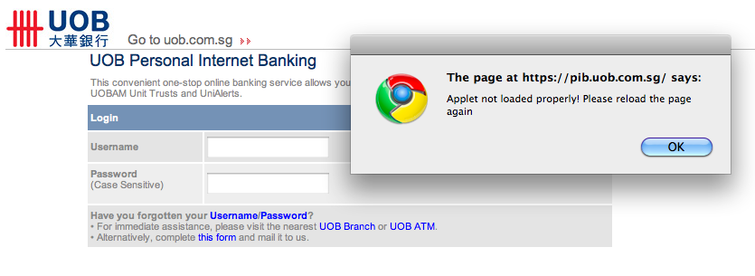

I have been suffering with login issues on [UOB](https://www.uob.com.sg/personal/index.html) internet banking site for as long as I can remember. I had to use Windows on a virtual machine to always login on UOB internet banking site.

<!--more-->



I checked java installation and its all in top shape. I knew that its some crappy javascript coding that is causing it to fail to load (or merely reporting it as "failed to load"). Surprisingly site got loaded perfectly on Firefox and Opera on OS X Lion. Puh! After searching internet for possible issue I ran into a chromium issue report [40364](https://code.google.com/p/chromium/issues/detail?id=40364). That made me wear my developer hat.

I started looking up for the error message all over the javascript and html code. I started by stepping through code in the "Developer Tools" in chrome. Main culprit here was initApplet() method in pib_login.js.

All you need to do is execute 'initApplet' and 'init' method on the login page after everything is finished loading. I tried writing an extension to DO THAT , but Chrome's extension protects the page javascript and css. It allows you to modify DOM only. So, I had to think of something else. And then I remembered "Bookmarklet". And here it is now. Just follow the steps below to get it working.

1. Drag the link below ("FIX UOB Login") to your bookmark bar (one time only) or create a bookmark with address/URL as one mentioned below (Updated).
1. Goto UOB internet banking page.
1. On the login page, after you get the error (see image) click "OK", **let the page load fully**
1. Once page is fully loaded, click on the bookmarklet (that you dragged in first step).
1. That's it you can login now.
1. Repeat step 2-5, every time you want to login.

[FIX UOB Login][1]

**Update**: Some users have reported issues with the bookmarklet. So, I am also posting javascript code that you can put as URL/Address of you bookmark to

```js
javascript:(function()%7Bif(location.href==%22https://pib.uob.com.sg/PIBLogin/appmanager/Login/Public%22)%7BinitApplet();init();%7D%7D)();
```

Please note, that this bookmarklet is designed for Singapore Personal Banking UOB site only. If you are going to any other UOB Banking site, then this Bookmarklet may not work

**Disclaimer**: _I will not be liable for any issues resulting, directly or indirectly, due to use of any information provided here._

[1]: javascript:(function()%7Bif(location.href==%22https://pib.uob.com.sg/PIBLogin/appmanager/Login/Public%22)%7BinitApplet();init();%7D%7D)();
