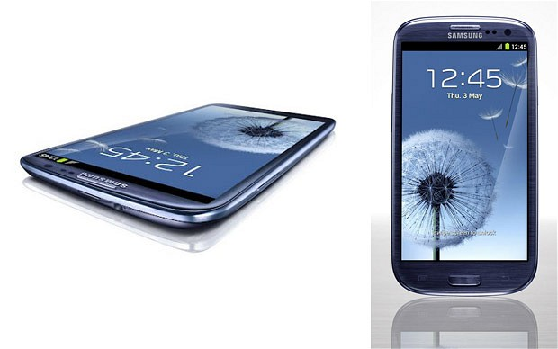

With local telcos slimming data bundle with phone plans and charging extra S\$2+ /gb, having radio on phone is great. Saves me 50megs a day. Or 1.5 gb a month.

<!--more-->

Widgets are great for quick updates glances, phone controls, etc.

Big screen is great for reading pages.

Otg (32gb), sd card (64gb) and 16 gb internal storage is more like unlimited storage.

My favorite feature in all android phone is that they are pc-less phones.

File/music/video/photo copy/beam/sync is so easy. I just works.
