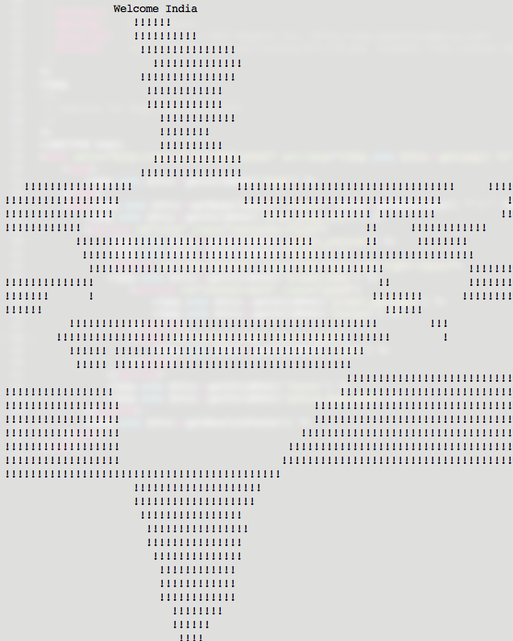

Map of India, drawn form C Code.

<!--excerpt-->

Going through social networks, I stumbled upon this code. It didn't make much sense to me, except for the fact that there were 2 loops doing something with a large string. But when I compiled it (with a tiny modification), it gave a great result. Here's code and result.

```c

// File: india.c
// India by C
#include "stdio.h"

int  main()
{
	int a,b,c;
	int count = 1;
	printf("\n \n \t\t Welcome India \n");
	for (b=c=10;a="- FIGURE?, UMKC,XYZHello Folks,\
		TFy!QJu ROo TNn(ROo)SLq SLq ULo+\
		UHs UJq TNn*RPn/ QPbEWS_JSWQAIJO^ \
		NBELPeHBFHT}TnA LVlBLOFAkHFOuFE Tp\
		HCStHAUFAgcEAel clcn^r^r\\tZvYx Xy\
		T|S~Pn SPm SOn TNn ULo0ULo#ULo-W\
		Hq!WFs XDt!" [b+++21]; )
		for(; a-- > 64 ; )
			putchar ( ++c=='Z' ? c = c/ 9:33^b&1);
	return 0;
}

```



_Credits_ : [Amit Adate](https://www.facebook.com/amit.adate)
