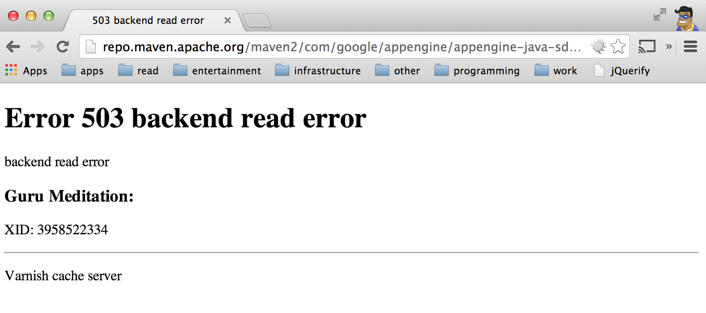

Google has released its App Engine SDK on Maven central as a zip. But its very large and causes a "**Error 503 backend read error**". <!--more-->
So, after a lot of head-banging I resolved this by adding SDK zip package (Yes! one from website) and a few jars (optional), to maven. Skip to end for the commands. You may have to modify these for a newer version.

# [tl;dr Skip to End](#gae_solution)

## Idea to Accident

I created a simple maven project for some usual "help a friend" work. It worked well, so I thought "Why not publish sources on GitHub?". After a few cycles, it looked ok, so I though I will push is to Google App Engine.

And,  the nightmare began. I added following plugin and dependency in `pom.xml`  based on official documentation.

```xml App Engie SDK Dependency
<dependency>
  <groupId>com.google.appengine</groupId>
  <artifactId>appengine-api-1.0-sdk</artifactId>
  <version>1.8.8</version>
</dependency>
```

```xml  App Engine Maven Plugin
<plugin>
  <groupId>com.google.appengine</groupId>
  <artifactId>appengine-maven-plugin</artifactId>
  <version>1.8.8</version>
</plugin>
```

Just to be safe, I downloaded latest GAE SDK (1.8.8), Eclipse Plugin, etc. As per documentation, I tried to start dev server with following command:

```shell Fire up local server
mvn appengine:devserver_start
```

After a long list of downloads, build failed. Bang! The trouble started. Got this:

```shell GAE Maven Failure
[INFO] <<< appengine-maven-plugin:1.8.8:devserver_start (default-cli) @ java-servlet <<<
[INFO]
[INFO] --- appengine-maven-plugin:1.8.8:devserver_start (default-cli) @ java-servlet ---
[INFO]
[INFO] Google App Engine Java SDK - Starting the Development Server
[INFO]
[INFO] Retrieving Google App Engine Java SDK from Maven
Downloading: http://repo.maven.apache.org/maven2/com/google/appengine/appengine-java-sdk/1.8.8/appengine-java-sdk-1.8.8.zip
[INFO] ------------------------------------------------------------------------
[INFO] BUILD FAILURE
[INFO] ------------------------------------------------------------------------
[INFO] Total time: 1:05.713s
[INFO] Finished at: Sat Jan 04 01:05:29 SGT 2014
[INFO] Final Memory: 17M/227M
[INFO] ------------------------------------------------------------------------
[ERROR] Failed to execute goal com.google.appengine:appengine-maven-plugin:1.8.8:devserver_start (default-cli) on project java-servlet: Could not resolve SDK artifact in Maven. Could not transfer artifact com.google.appengine:appengine-java-sdk:zip:1.8.8 from/to central (http://repo.maven.apache.org/maven2): Failed to transfer file: http://repo.maven.apache.org/maven2/com/google/appengine/appengine-java-sdk/1.8.8/appengine-java-sdk-1.8.8.zip. Return code is: 503 , ReasonPhrase:backend read error. -> [Help 1]
[ERROR]
[ERROR] To see the full stack trace of the errors, re-run Maven with the -e switch.
[ERROR] Re-run Maven using the -X switch to enable full debug logging.
[ERROR]
[ERROR] For more information about the errors and possible solutions, please read the following articles:
[ERROR] [Help 1] http://cwiki.apache.org/confluence/display/MAVEN/MojoExecutionException
```

This was unusual. So I tried again. Its maven central server not an "under-the-desk-server". But same no change. I tried to download zip manually, just to be sure that artifact is indeed there. Damn it! I got same error, just a little more fancy looking though!



In directory index ([here](https://repo.maven.apache.org/maven2/com/google/appengine/appengine-java-sdk/1.8.8)), I saw that this file was a large (150+MB). So, now what? I did deploy the application after testing on Tomcat 7. I used simple appcfg.sh command.

```shell "Temporary Solution"
mvn tomcat7:run
...
...
appcfg.sh update target/java-servlet
```

But, this was not a "cool" way. Maven is my project management tool, and I should use it as much as possible.

## Accident to Revival

After googling, reading, googling, reading and googling, I stumbled upon an [old blog](https://shal.in/post/285908979/google-app-engine-and-maven) that added 1.2 version of SDK to maven using `install:install-file` goal. Eureka! Why not do this with SDK zip? Thats it. Here are the commands

## Solution

Install SDK zip via following command.

```shell
mvn install:install-file \
  -Dfile=appengine-java-sdk-1.8.8.zip \
  -DgroupId=com.google.appengine \
  -DartifactId=appenging-java-sdk \
  -Dversion=1.8.8 \
  -Dpackaging=zip \
  -DgeneratePom=true
```

And, an optional JAR install can be done via:

```shell
mvn install:install-file \
  -Dfile=appengine-java-sdk-1.8.8/lib/appengine-tools-api.jar
  -DgroupId=com.google \
  -DartifactId=appengine-tools \
  -Dversion=1.8.8 \
  -Dpackaging=jar \
  -DgeneratePom=true

mvn install:install-file \
  -Dfile=appengine-java-sdk-1.8.8/lib/shared/appengine-local-runtime-shared.jar \
  -DgroupId=com.google \
  -DartifactId=appengine-local-runtime-shared \
  -Dversion=1.8.8 \
  -Dpackaging=jar \
  -DgeneratePom=true

mvn install:install-file \
  -Dfile=appengine-java-sdk-1.8.8/lib/user/appengine-api-1.0-sdk-1.8.8.jar \
  -DgroupId=com.google \
  -DartifactId=appengine-sdk-1.8.8-api \
  -Dversion=1.8.8 \
  -Dpackaging=jar \
  -DgeneratePom=true

mvn install:install-file \
  -Dfile=appengine-java-sdk-1.8.8/lib/user/orm/datanucleus-appengine-1.0.10.final.jar \
  -DgroupId=org.datanucleus \
  -DartifactId=datanucleus-appengine \
  -Dversion=1.0.10.final \
  -Dpackaging=jar \
  -DgeneratePom=true
```

- Project :   [Source](https://github.com/yogendra/java-servlet) | [Live](https://java-servlet.yogendra.me)
- Google App Engine: [Maven](https://developers.google.com/appengine/docs/java/tools/maven) | [Dowloads](https://developers.google.com/appengine/downloads#Google_App_Engine_SDK_for_Java)
