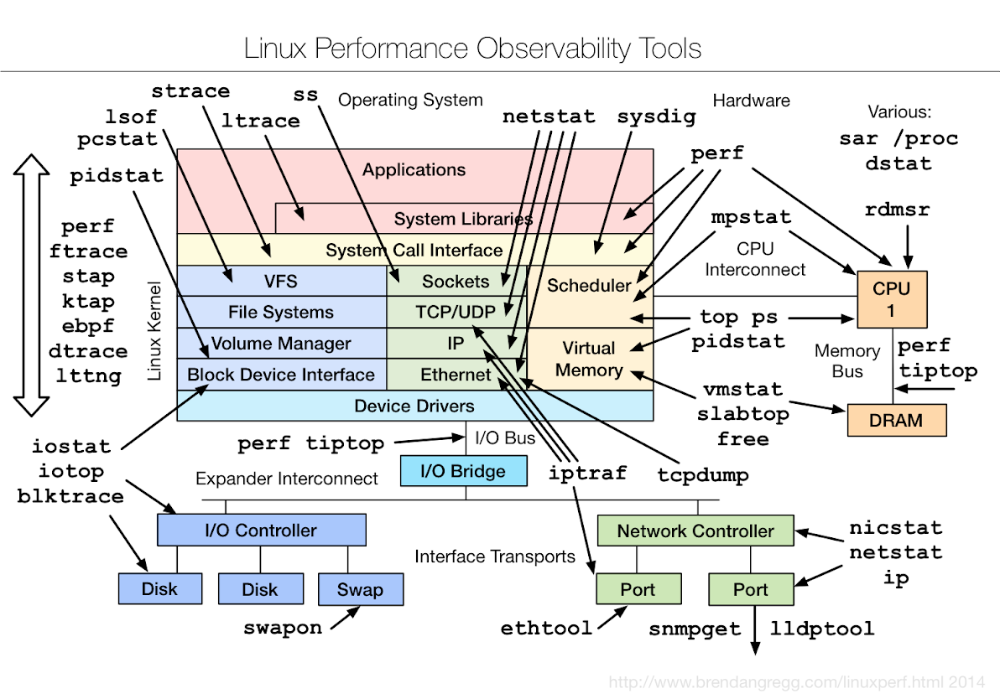

I use linux for all production deployments (Obviously). Here is a quick one image run down for all optimizations.

<!--more-->

Source: [linux.com][linux-com]

[linux-com]: https://www.linux.com/news/enterprise/systems-management/785426-a-template-for-monitoring-linux-performance-tools-like-from-netflix
