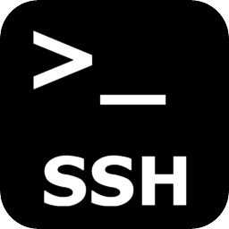

Good list of commands to be SSH 'Yoda'. I like the tunnels and screen the most in these. They have been so useful over the years, for development and troubleshooting.

<!--more-->



Here is a short list that I use ofter:

```bash
# Copy SSH public key
$ ssh-copy-id user@host

# Alternative for ssh-copy-id
$ cat ~/.ssh/id_rsa.pub | ssh user@machine “mkdir ~/.ssh; cat >> ~/.ssh/authorized_keys”
# Start a tunnel local:2001 -> remote:80
$ ssh -N -L2001:localhost:80 somemachine

# Run a GUI app from remote machine
$ ssh -fX <user>@<host> <program>

# SSH to machien behind NAT
$ ssh -NR 0.0.0.0:2222:127.0.0.1:22 user@jump.host.com

```

Click to [Original Post][30-ssh-shenanigans]


[30-ssh-shenanigans]: https://www.blackmoreops.com/2016/11/08/top-30-ssh-shenanigans
