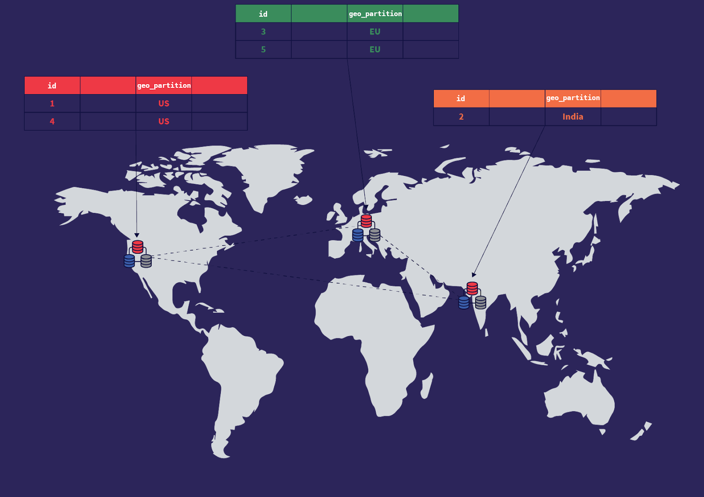
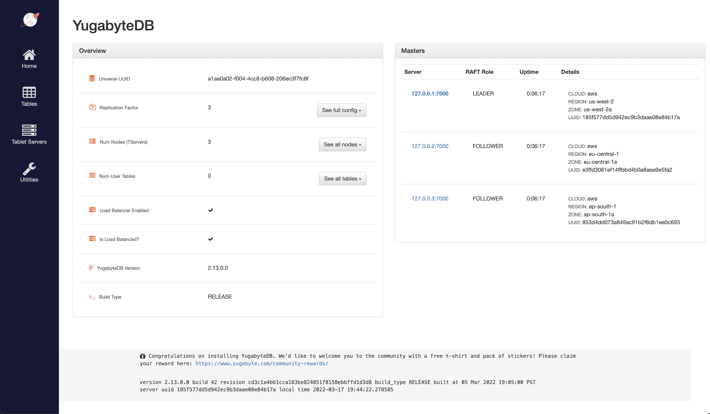
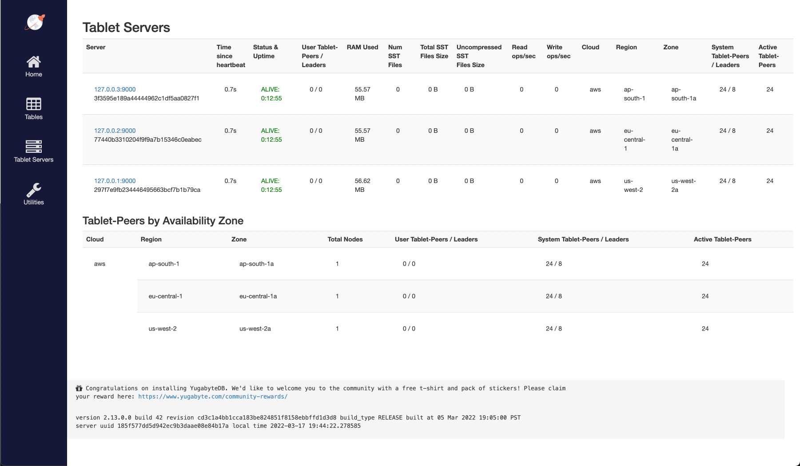
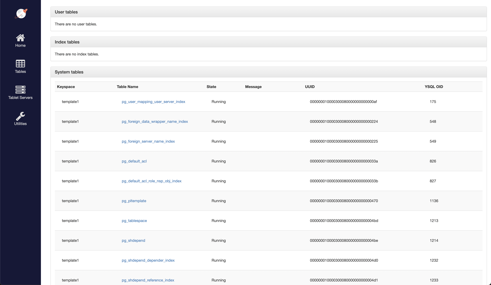
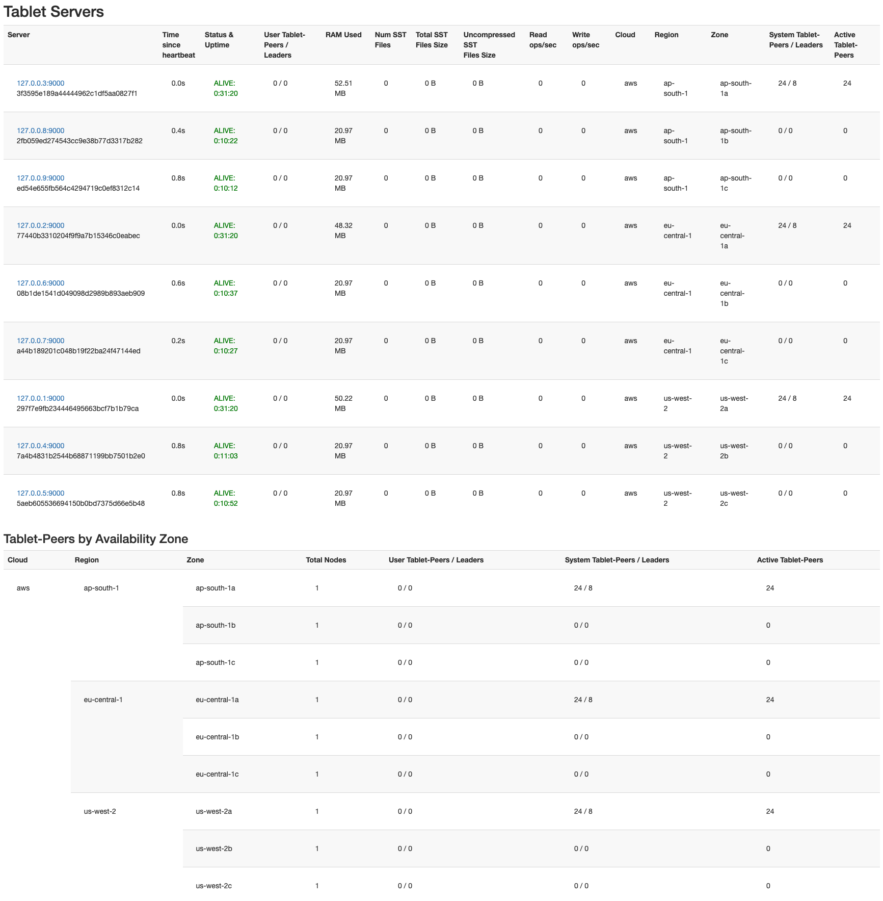
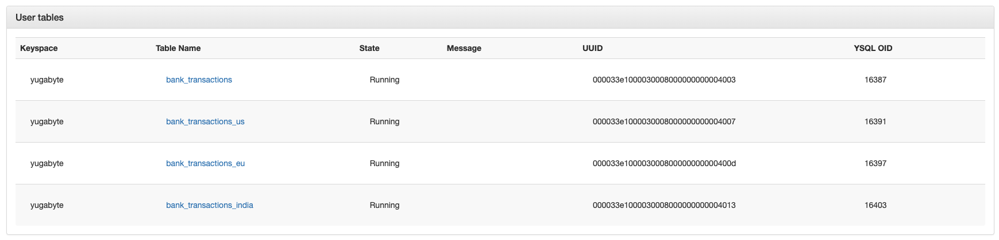

Lets have look at one of the most interesting features of YugabyteDB - Row Level Geo-distribution

<!-- more -->


I have joined Yugabyte a while back. I have gone through many demos/samples. But one thing that caught my attention very early on was the geo-pinning the data.

This capability can simplify compliance of data privacy laws, data sovereignty laws, etc. It can make the overall architecture of the application very simple.
Here is my stab at this feature. I followed the documentation for most part. I added only the cluster management parts to the whole guide for a quick self-drive.

Instead of working with actual cloud, I ran the whole setup on my machine. This will need about 2GB of free RAM. At its peak, there will be 3 master (100MB), 12 tserver(100MB) and 12 postgres (50MB) processes.
I wanted to remove the network out of the picture to understand the data persistance portion of Yugabyte, hence the local machine cluster.

## Pre-requisites

You will require Yugabyte binaries for your platform. On Macs with Apple Silicon, you should have rosetta

1. [YugabyteDB binary (Mac/Linux-x86/ Linux-aarch64)](https://download.yugabyte.com/)

   **Mac**

   ```bash
   curl -O https://downloads.yugabyte.com/releases/2.13.0.0/yugabyte-2.13.0.0-b42-darwin-x86_64.tar.gz
   tar xvfz yugabyte-2.13.0.0-b42-darwin-x86_64.tar.gz
   echo "export PATH=$PWD/yugabyte-2.13.0.0/bin:\$PATH" >> $HOME/.bashrc
   source $HOME/.bashrc
   ```

   On Macs with Apple Silicon, you should have [Rosetta installed](https://support.apple.com/en-sg/HT211861).

   **Linux**

   ```bash
   wget https://downloads.yugabyte.com/releases/2.13.0.0/yugabyte-2.13.0.0-b42-linux-x86_64.tar.gz
   tar xvfz yugabyte-2.13.0.0-b42-linux-x86_64.tar.gz
   echo "export PATH=$PWD/yugabyte-2.13.0.0/bin:\$PATH" >> $HOME/.bashrc
   source $HOME/.bashrc
   $PWD/yugabyte-2.13.0.0/bin/post_install.sh
   ```

1. Additional 12 alias/IPs for loopback interface

   **Mac/Linux**

   This is an ephemeral setup and will get reset ones you reboot machine. You can re-run the same command to setup interfaces, in case of a reboot.

   ```bash
   for i in {1..12}
   do
     sudo ifconfig lo0 alias  127.0.0.$i up
   done
   ```

   Check the aliases

   ```bash
    ifconfig lo0
   ```

   **Output**

   ```log
    lo0: flags=8049<UP,LOOPBACK,RUNNING,MULTICAST> mtu 16384
            options=1203<RXCSUM,TXCSUM,TXSTATUS,SW_TIMESTAMP>
            inet 127.0.0.1 netmask 0xff000000
            inet6 ::1 prefixlen 128
            inet6 fe80::1%lo0 prefixlen 64 scopeid 0x1
            inet 127.0.0.2 netmask 0xff000000
            inet 127.0.0.3 netmask 0xff000000
            inet 127.0.0.4 netmask 0xff000000
            inet 127.0.0.5 netmask 0xff000000
            inet 127.0.0.6 netmask 0xff000000
            inet 127.0.0.7 netmask 0xff000000
            inet 127.0.0.8 netmask 0xff000000
            inet 127.0.0.9 netmask 0xff000000
            inet 127.0.0.10 netmask 0xff000000
            inet 127.0.0.11 netmask 0xff000000
            inet 127.0.0.12 netmask 0xff000000
            nd6 options=201<PERFORMNUD,DAD>
   ```

## Setup Local Cluster

1. Clean up any existing cluster (in case you are repeating or followed another tutorial).

   ```bash
   yb-ctl destroy --data_dir $PWD/data
   ```

   **Output**

   ```log
   Destroying cluster.
   ```

1. Create a new cluster. This cluster will have replication factor of 3, and will have nodes spread in 3 regions. 1 node per region. We will use **us-west-2**, **eu-central-1** and **ap-south-1** regions of **aws**. And we will use the **us-west-2a**, **eu-central-1a** and **ap-south-1a** zones, from these regions.

   ```bash
   yb-ctl start --data_dir $PWD/data --rf 3  --placement_info "aws.us-west-2.us-west-2a,aws.eu-central-1.eu-central-1a,aws.ap-south-1.ap-south-1a"
   ```

   **NOTE for Mac:** You will get multiple (6) prompts/dialogs stating _yb-tserver_ or _yb-master_ to accept incoming connections. Allow all of them. This will happen later when we add more nodes. Repeat

   **Output**

   ```log
   Creating cluster.
   Waiting for cluster to be ready.
   ----------------------------------------------------------------------------------------------------
   | Node Count: 3 | Replication Factor: 3                                                            |
   ----------------------------------------------------------------------------------------------------
   | JDBC                : jdbc:postgresql://127.0.0.1:5433/yugabyte                                  |
   | YSQL Shell          : yugabyte-2.13.0.0/bin/ysqlsh                                               |
   | YCQL Shell          : yugabyte-2.13.0.0/bin/ycqlsh                                               |
   | YEDIS Shell         : yugabyte-2.13.0.0/bin/redis-cli                                            |
   | Web UI              : http://127.0.0.1:7000/                                                     |
   | Cluster Data        : /tmp/demo/data                                                             |
   ----------------------------------------------------------------------------------------------------

   For more info, please use: yb-ctl --data_dir /tmp/demo/data status
   ```

1. (Optional) Check the current cluster configuration

   ```bash
   yb-ctl status --data_dir $PWD/data
   ```

   **Output**

   ```log
   ----------------------------------------------------------------------------------------------------
   | Node Count: 3 | Replication Factor: 3                                                            |
   ----------------------------------------------------------------------------------------------------
   | JDBC                : jdbc:postgresql://127.0.0.1:5433/yugabyte                                  |
   | YSQL Shell          : yugabyte-2.13.0.0/bin/ysqlsh                                               |
   | YCQL Shell          : yugabyte-2.13.0.0/bin/ycqlsh                                               |
   | YEDIS Shell         : yugabyte-2.13.0.0/bin/redis-cli                                            |
   | Web UI              : http://127.0.0.1:7000/                                                     |
   | Cluster Data        : /tmp/demo/data                                                             |
   ----------------------------------------------------------------------------------------------------
   ----------------------------------------------------------------------------------------------------
   | Node 1: yb-tserver (pid 90648), yb-master (pid 90639)                                            |
   ----------------------------------------------------------------------------------------------------
   | JDBC                : jdbc:postgresql://127.0.0.1:5433/yugabyte                                  |
   | YSQL Shell          : yugabyte-2.13.0.0/bin/ysqlsh                                               |
   | YCQL Shell          : yugabyte-2.13.0.0/bin/ycqlsh                                               |
   | YEDIS Shell         : yugabyte-2.13.0.0/bin/redis-cli                                            |
   | data-dir[0]         : /tmp/demo/data/node-1/disk-1/yb-data                                       |
   | yb-tserver Logs     : /tmp/demo/data/node-1/disk-1/yb-data/tserver/logs                          |
   | yb-master Logs      : /tmp/demo/data/node-1/disk-1/yb-data/master/logs                           |
   ----------------------------------------------------------------------------------------------------
   ----------------------------------------------------------------------------------------------------
   | Node 2: yb-tserver (pid 90651), yb-master (pid 90642)                                            |
   ----------------------------------------------------------------------------------------------------
   | JDBC                : jdbc:postgresql://127.0.0.2:5433/yugabyte                                  |
   | YSQL Shell          : yugabyte-2.13.0.0/bin/ysqlsh -h 127.0.0.2                                  |
   | YCQL Shell          : yugabyte-2.13.0.0/bin/ycqlsh 127.0.0.2                                     |
   | YEDIS Shell         : yugabyte-2.13.0.0/bin/redis-cli -h 127.0.0.2                               |
   | data-dir[0]         : /tmp/demo/data/node-2/disk-1/yb-data                                       |
   | yb-tserver Logs     : /tmp/demo/data/node-2/disk-1/yb-data/tserver/logs                          |
   | yb-master Logs      : /tmp/demo/data/node-2/disk-1/yb-data/master/logs                           |
   ----------------------------------------------------------------------------------------------------
   ----------------------------------------------------------------------------------------------------
   | Node 3: yb-tserver (pid 90654), yb-master (pid 90645)                                            |
   ----------------------------------------------------------------------------------------------------
   | JDBC                : jdbc:postgresql://127.0.0.3:5433/yugabyte                                  |
   | YSQL Shell          : yugabyte-2.13.0.0/bin/ysqlsh -h 127.0.0.3                                  |
   | YCQL Shell          : yugabyte-2.13.0.0/bin/ycqlsh 127.0.0.3                                     |
   | YEDIS Shell         : yugabyte-2.13.0.0/bin/redis-cli -h 127.0.0.3                               |
   | data-dir[0]         : /tmp/demo/data/node-3/disk-1/yb-data                                       |
   | yb-tserver Logs     : /tmp/demo/data/node-3/disk-1/yb-data/tserver/logs                          |
   | yb-master Logs      : /tmp/demo/data/node-3/disk-1/yb-data/master/logs                           |
   ----------------------------------------------------------------------------------------------------
   ```

1. (Optional) Launch the [Master UI](http://127.0.0.1:7000) in browser for looking at the state of cluster

   

   1. You can examine the cluster config JSON by clicking on **Home > Overview > (See full config)** [or click here](http://127.0.0.1:7000/cluster-config)

      **Config**

      ```yaml
      version: 1
      replication_info {
        live_replicas {
          num_replicas: 3
          placement_blocks {
            cloud_info {
              placement_cloud: "aws"
              placement_region: "eu-central-1"
              placement_zone: "eu-central-1a"
            }
            min_num_replicas: 1
          }
          placement_blocks {
            cloud_info {
              placement_cloud: "aws"
              placement_region: "ap-south-1"
              placement_zone: "ap-south-1a"
            }
            min_num_replicas: 1
          }
          placement_blocks {
            cloud_info {
              placement_cloud: "aws"
              placement_region: "us-west-2"
              placement_zone: "us-west-2a"
            }
            min_num_replicas: 1
          }
        }
      }
      cluster_uuid: "a1ae0a02-f004-4cc8-b608-206ec3f7fc8f"
      ```

   1. You can check TServer details by clicking **Home > Overview > (See all nodes)** [or click here](http://127.0.0.1:7000/tablet-servers)

      **Screenshot**

      

   1. You can check tables by clicking **Home > Overview > (See all tables)** [or click here](http://127.0.0.1:7000/tables)

      **Screenshot**

      


1. Back on command prompt, lets add 2 additional nodes for each of the 3 region. So, 6 additional nodes have to be added. This will make total node count to 9. We want to keep each node is a separate zone for intra-region resiliency.

   ```bash

   yb-ctl --data_dir $PWD/data add_node --placement_info "aws.us-west-2.us-west-2b"
   yb-ctl --data_dir $PWD/data add_node --placement_info "aws.us-west-2.us-west-2c"

   yb-ctl --data_dir $PWD/data add_node --placement_info "aws.eu-central-1.eu-central-1b"
   yb-ctl --data_dir $PWD/data add_node --placement_info "aws.eu-central-1.eu-central-1c"

   yb-ctl --data_dir $PWD/data add_node --placement_info "aws.ap-south-1.ap-south-1b"
   yb-ctl --data_dir $PWD/data add_node --placement_info "aws.ap-south-1.ap-south-1c"

   ```

   **Output**

   ```log
   Adding node.
   Waiting for cluster to be ready.
   ----------------------------------------------------------------------------------------------------
   | Node 4: yb-tserver (pid 91265)                                                                   |
   ----------------------------------------------------------------------------------------------------
   | JDBC                : jdbc:postgresql://127.0.0.4:5433/yugabyte                                  |
   | YSQL Shell          : yugabyte-2.13.0.0/bin/ysqlsh -h 127.0.0.4                                  |
   | YCQL Shell          : yugabyte-2.13.0.0/bin/ycqlsh 127.0.0.4                                     |
   | YEDIS Shell         : yugabyte-2.13.0.0/bin/redis-cli -h 127.0.0.4                               |
   | data-dir[0]         : /tmp/demo/data/node-4/disk-1/yb-data                                       |
   | yb-tserver Logs     : /tmp/demo/data/node-4/disk-1/yb-data/tserver/logs                          |
   ----------------------------------------------------------------------------------------------------
   Adding node.
   Waiting for cluster to be ready.
   ----------------------------------------------------------------------------------------------------
   | Node 5: yb-tserver (pid 91323)                                                                   |
   ----------------------------------------------------------------------------------------------------
   | JDBC                : jdbc:postgresql://127.0.0.5:5433/yugabyte                                  |
   | YSQL Shell          : yugabyte-2.13.0.0/bin/ysqlsh -h 127.0.0.5                                  |
   | YCQL Shell          : yugabyte-2.13.0.0/bin/ycqlsh 127.0.0.5                                     |
   | YEDIS Shell         : yugabyte-2.13.0.0/bin/redis-cli -h 127.0.0.5                               |
   | data-dir[0]         : /tmp/demo/data/node-5/disk-1/yb-data                                       |
   | yb-tserver Logs     : /tmp/demo/data/node-5/disk-1/yb-data/tserver/logs                          |
   ----------------------------------------------------------------------------------------------------
   Adding node.
   Waiting for cluster to be ready.
   ----------------------------------------------------------------------------------------------------
   | Node 6: yb-tserver (pid 91385)                                                                   |
   ----------------------------------------------------------------------------------------------------
   | JDBC                : jdbc:postgresql://127.0.0.6:5433/yugabyte                                  |
   | YSQL Shell          : yugabyte-2.13.0.0/bin/ysqlsh -h 127.0.0.6                                  |
   | YCQL Shell          : yugabyte-2.13.0.0/bin/ycqlsh 127.0.0.6                                     |
   | YEDIS Shell         : yugabyte-2.13.0.0/bin/redis-cli -h 127.0.0.6                               |
   | data-dir[0]         : /tmp/demo/data/node-6/disk-1/yb-data                                       |
   | yb-tserver Logs     : /tmp/demo/data/node-6/disk-1/yb-data/tserver/logs                          |
   ----------------------------------------------------------------------------------------------------
   Adding node.
   Waiting for cluster to be ready.
   ----------------------------------------------------------------------------------------------------
   | Node 7: yb-tserver (pid 91449)                                                                   |
   ----------------------------------------------------------------------------------------------------
   | JDBC                : jdbc:postgresql://127.0.0.7:5433/yugabyte                                  |
   | YSQL Shell          : yugabyte-2.13.0.0/bin/ysqlsh -h 127.0.0.7                                  |
   | YCQL Shell          : yugabyte-2.13.0.0/bin/ycqlsh 127.0.0.7                                     |
   | YEDIS Shell         : yugabyte-2.13.0.0/bin/redis-cli -h 127.0.0.7                               |
   | data-dir[0]         : /tmp/demo/data/node-7/disk-1/yb-data                                       |
   | yb-tserver Logs     : /tmp/demo/data/node-7/disk-1/yb-data/tserver/logs                          |
   ----------------------------------------------------------------------------------------------------
   Adding node.
   Waiting for cluster to be ready.
   ----------------------------------------------------------------------------------------------------
   | Node 8: yb-tserver (pid 91495)                                                                   |
   ----------------------------------------------------------------------------------------------------
   | JDBC                : jdbc:postgresql://127.0.0.8:5433/yugabyte                                  |
   | YSQL Shell          : yugabyte-2.13.0.0/bin/ysqlsh -h 127.0.0.8                                  |
   | YCQL Shell          : yugabyte-2.13.0.0/bin/ycqlsh 127.0.0.8                                     |
   | YEDIS Shell         : yugabyte-2.13.0.0/bin/redis-cli -h 127.0.0.8                               |
   | data-dir[0]         : /tmp/demo/data/node-8/disk-1/yb-data                                       |
   | yb-tserver Logs     : /tmp/demo/data/node-8/disk-1/yb-data/tserver/logs                          |
   ----------------------------------------------------------------------------------------------------
   Adding node.
   Waiting for cluster to be ready.
   ----------------------------------------------------------------------------------------------------
   | Node 9: yb-tserver (pid 91549)                                                                   |
   ----------------------------------------------------------------------------------------------------
   | JDBC                : jdbc:postgresql://127.0.0.9:5433/yugabyte                                  |
   | YSQL Shell          : yugabyte-2.13.0.0/bin/ysqlsh -h 127.0.0.9                                  |
   | YCQL Shell          : yugabyte-2.13.0.0/bin/ycqlsh 127.0.0.9                                     |
   | YEDIS Shell         : yugabyte-2.13.0.0/bin/redis-cli -h 127.0.0.9                               |
   | data-dir[0]         : /tmp/demo/data/node-9/disk-1/yb-data                                       |
   | yb-tserver Logs     : /tmp/demo/data/node-9/disk-1/yb-data/tserver/logs                          |
   ----------------------------------------------------------------------------------------------------
   ```

1. (Optional) Check the current cluster configuration

   ```bash
   yb-ctl status --data_dir $PWD/data
   ```

   **Output**

   ```log
   ----------------------------------------------------------------------------------------------------
   | Node Count: 9 | Replication Factor: 3                                                            |
   ----------------------------------------------------------------------------------------------------
   | JDBC                : jdbc:postgresql://127.0.0.1:5433/yugabyte                                  |
   | YSQL Shell          : yugabyte-2.13.0.0/bin/ysqlsh                                               |
   | YCQL Shell          : yugabyte-2.13.0.0/bin/ycqlsh                                               |
   | YEDIS Shell         : yugabyte-2.13.0.0/bin/redis-cli                                            |
   | Web UI              : http://127.0.0.1:7000/                                                     |
   | Cluster Data        : /tmp/demo/data                                                             |
   ----------------------------------------------------------------------------------------------------
   ----------------------------------------------------------------------------------------------------
   | Node 1: yb-tserver (pid 90648), yb-master (pid 90639)                                            |
   ----------------------------------------------------------------------------------------------------
   | JDBC                : jdbc:postgresql://127.0.0.1:5433/yugabyte                                  |
   | YSQL Shell          : yugabyte-2.13.0.0/bin/ysqlsh                                               |
   | YCQL Shell          : yugabyte-2.13.0.0/bin/ycqlsh                                               |
   | YEDIS Shell         : yugabyte-2.13.0.0/bin/redis-cli                                            |
   | data-dir[0]         : /tmp/demo/data/node-1/disk-1/yb-data                                       |
   | yb-tserver Logs     : /tmp/demo/data/node-1/disk-1/yb-data/tserver/logs                          |
   | yb-master Logs      : /tmp/demo/data/node-1/disk-1/yb-data/master/logs                           |
   ----------------------------------------------------------------------------------------------------
   ----------------------------------------------------------------------------------------------------
   | Node 2: yb-tserver (pid 90651), yb-master (pid 90642)                                            |
   ----------------------------------------------------------------------------------------------------
   | JDBC                : jdbc:postgresql://127.0.0.2:5433/yugabyte                                  |
   | YSQL Shell          : yugabyte-2.13.0.0/bin/ysqlsh -h 127.0.0.2                                  |
   | YCQL Shell          : yugabyte-2.13.0.0/bin/ycqlsh 127.0.0.2                                     |
   | YEDIS Shell         : yugabyte-2.13.0.0/bin/redis-cli -h 127.0.0.2                               |
   | data-dir[0]         : /tmp/demo/data/node-2/disk-1/yb-data                                       |
   | yb-tserver Logs     : /tmp/demo/data/node-2/disk-1/yb-data/tserver/logs                          |
   | yb-master Logs      : /tmp/demo/data/node-2/disk-1/yb-data/master/logs                           |
   ----------------------------------------------------------------------------------------------------
   ----------------------------------------------------------------------------------------------------
   | Node 3: yb-tserver (pid 90654), yb-master (pid 90645)                                            |
   ----------------------------------------------------------------------------------------------------
   | JDBC                : jdbc:postgresql://127.0.0.3:5433/yugabyte                                  |
   | YSQL Shell          : yugabyte-2.13.0.0/bin/ysqlsh -h 127.0.0.3                                  |
   | YCQL Shell          : yugabyte-2.13.0.0/bin/ycqlsh 127.0.0.3                                     |
   | YEDIS Shell         : yugabyte-2.13.0.0/bin/redis-cli -h 127.0.0.3                               |
   | data-dir[0]         : /tmp/demo/data/node-3/disk-1/yb-data                                       |
   | yb-tserver Logs     : /tmp/demo/data/node-3/disk-1/yb-data/tserver/logs                          |
   | yb-master Logs      : /tmp/demo/data/node-3/disk-1/yb-data/master/logs                           |
   ----------------------------------------------------------------------------------------------------
   ----------------------------------------------------------------------------------------------------
   | Node 4: yb-tserver (pid 91265)                                                                   |
   ----------------------------------------------------------------------------------------------------
   | JDBC                : jdbc:postgresql://127.0.0.4:5433/yugabyte                                  |
   | YSQL Shell          : yugabyte-2.13.0.0/bin/ysqlsh -h 127.0.0.4                                  |
   | YCQL Shell          : yugabyte-2.13.0.0/bin/ycqlsh 127.0.0.4                                     |
   | YEDIS Shell         : yugabyte-2.13.0.0/bin/redis-cli -h 127.0.0.4                               |
   | data-dir[0]         : /tmp/demo/data/node-4/disk-1/yb-data                                       |
   | yb-tserver Logs     : /tmp/demo/data/node-4/disk-1/yb-data/tserver/logs                          |
   ----------------------------------------------------------------------------------------------------
   ----------------------------------------------------------------------------------------------------
   | Node 5: yb-tserver (pid 91323)                                                                   |
   ----------------------------------------------------------------------------------------------------
   | JDBC                : jdbc:postgresql://127.0.0.5:5433/yugabyte                                  |
   | YSQL Shell          : yugabyte-2.13.0.0/bin/ysqlsh -h 127.0.0.5                                  |
   | YCQL Shell          : yugabyte-2.13.0.0/bin/ycqlsh 127.0.0.5                                     |
   | YEDIS Shell         : yugabyte-2.13.0.0/bin/redis-cli -h 127.0.0.5                               |
   | data-dir[0]         : /tmp/demo/data/node-5/disk-1/yb-data                                       |
   | yb-tserver Logs     : /tmp/demo/data/node-5/disk-1/yb-data/tserver/logs                          |
   ----------------------------------------------------------------------------------------------------
   ----------------------------------------------------------------------------------------------------
   | Node 6: yb-tserver (pid 91385)                                                                   |
   ----------------------------------------------------------------------------------------------------
   | JDBC                : jdbc:postgresql://127.0.0.6:5433/yugabyte                                  |
   | YSQL Shell          : yugabyte-2.13.0.0/bin/ysqlsh -h 127.0.0.6                                  |
   | YCQL Shell          : yugabyte-2.13.0.0/bin/ycqlsh 127.0.0.6                                     |
   | YEDIS Shell         : yugabyte-2.13.0.0/bin/redis-cli -h 127.0.0.6                               |
   | data-dir[0]         : /tmp/demo/data/node-6/disk-1/yb-data                                       |
   | yb-tserver Logs     : /tmp/demo/data/node-6/disk-1/yb-data/tserver/logs                          |
   ----------------------------------------------------------------------------------------------------
   ----------------------------------------------------------------------------------------------------
   | Node 7: yb-tserver (pid 91449)                                                                   |
   ----------------------------------------------------------------------------------------------------
   | JDBC                : jdbc:postgresql://127.0.0.7:5433/yugabyte                                  |
   | YSQL Shell          : yugabyte-2.13.0.0/bin/ysqlsh -h 127.0.0.7                                  |
   | YCQL Shell          : yugabyte-2.13.0.0/bin/ycqlsh 127.0.0.7                                     |
   | YEDIS Shell         : yugabyte-2.13.0.0/bin/redis-cli -h 127.0.0.7                               |
   | data-dir[0]         : /tmp/demo/data/node-7/disk-1/yb-data                                       |
   | yb-tserver Logs     : /tmp/demo/data/node-7/disk-1/yb-data/tserver/logs                          |
   ----------------------------------------------------------------------------------------------------
   ----------------------------------------------------------------------------------------------------
   | Node 8: yb-tserver (pid 91495)                                                                   |
   ----------------------------------------------------------------------------------------------------
   | JDBC                : jdbc:postgresql://127.0.0.8:5433/yugabyte                                  |
   | YSQL Shell          : yugabyte-2.13.0.0/bin/ysqlsh -h 127.0.0.8                                  |
   | YCQL Shell          : yugabyte-2.13.0.0/bin/ycqlsh 127.0.0.8                                     |
   | YEDIS Shell         : yugabyte-2.13.0.0/bin/redis-cli -h 127.0.0.8                               |
   | data-dir[0]         : /tmp/demo/data/node-8/disk-1/yb-data                                       |
   | yb-tserver Logs     : /tmp/demo/data/node-8/disk-1/yb-data/tserver/logs                          |
   ----------------------------------------------------------------------------------------------------
   ----------------------------------------------------------------------------------------------------
   | Node 9: yb-tserver (pid 91549)                                                                   |
   ----------------------------------------------------------------------------------------------------
   | JDBC                : jdbc:postgresql://127.0.0.9:5433/yugabyte                                  |
   | YSQL Shell          : yugabyte-2.13.0.0/bin/ysqlsh -h 127.0.0.9                                  |
   | YCQL Shell          : yugabyte-2.13.0.0/bin/ycqlsh 127.0.0.9                                     |
   | YEDIS Shell         : yugabyte-2.13.0.0/bin/redis-cli -h 127.0.0.9                               |
   | data-dir[0]         : /tmp/demo/data/node-9/disk-1/yb-data                                       |
   | yb-tserver Logs     : /tmp/demo/data/node-9/disk-1/yb-data/tserver/logs                          |
   ----------------------------------------------------------------------------------------------------
   ```

1. (Optional) Check the TServers details by clicking **Home > Overview > (See all nodes)** [or click here](http://127.0.0.1:7000/tablet-servers)

   **Screenshot**

   


Now, we have created a multi-region cluster across 3 regions and 9 zones. Each zone has 1 node in it. Table below shows Region/Zone wise list of nodes with roles.

| Region       | Zone          | IP        | Role           |
| ------------ | ------------- | --------- | -------------- |
| ap-south-1   | ap-south-1a   | 127.0.0.3 | master,tserver |
| ap-south-1   | ap-south-1b   | 127.0.0.8 | tserver        |
| ap-south-1   | ap-south-1c   | 127.0.0.9 | tserver        |
| us-west-2    | us-west-2a    | 127.0.0.1 | master,tserver |
| us-west-2    | us-west-2b    | 127.0.0.4 | tserver        |
| us-west-2    | us-west-2c    | 127.0.0.5 | tserver        |
| eu-central-1 | eu-central-1a | 127.0.0.2 | master,tserver |
| eu-central-1 | eu-central-1b | 127.0.0.6 | tserver        |
| eu-central-1 | eu-central-1c | 127.0.0.7 | tserver        |

## Global Transactions

In this exercise, we will create a single **bank_transactions** table. Out aim is to place the transaction records for each geo in its own nodes. This is simulating the enforcement of data privacy/sovereignty rules with in a single database. We will use SQL queries to simulate application interactions.

Lets launch YSQL Shell to perform all the SQL query operations.

```bash
ysqlsh
```

**Output**

```log
ysqlsh (11.2-YB-2.13.0.0-b0)
Type "help" for help.

yugabyte=#
```

You may exit **YSQL Shell** anytime by typing `\q<enter>`, `<ctrl>+d` or `quit;<enter>`.

### Setup tablespace for each geo

1. Create geo-partitioned tablespace for `us-west-2`

   ```sql
   CREATE TABLESPACE us_west_2_tablespace WITH (
     replica_placement='{"num_replicas": 3, "placement_blocks":
     [{"cloud":"aws","region":"us-west-2","zone":"us-west-2a","min_num_replicas":1},
     {"cloud":"aws","region":"us-west-2","zone":"us-west-2b","min_num_replicas":1},
     {"cloud":"aws","region":"us-west-2","zone":"us-west-2c","min_num_replicas":1}]}'
   );
   ```

   **Output**

   ```log
   CREATE TABLESPACE
   ```

1. Create geo-partitioned tablespace for `eu-central-1`

   ```sql

   CREATE TABLESPACE eu_central_1_tablespace WITH (
     replica_placement='{"num_replicas": 3, "placement_blocks":
     [{"cloud":"aws","region":"eu-central-1","zone":"eu-central-1a","min_num_replicas":1},
     {"cloud":"aws","region":"eu-central-1","zone":"eu-central-1b","min_num_replicas":1},
     {"cloud":"aws","region":"eu-central-1","zone":"eu-central-1c","min_num_replicas":1}]}'
   );
   ```

   **Output**

   ```log
   CREATE TABLESPACE
   ```

1. Create geo-partitioned tablespace for `ap-south-1`

   ```sql
   CREATE TABLESPACE ap_south_1_tablespace WITH (
     replica_placement='{"num_replicas": 3, "placement_blocks":
     [{"cloud":"aws","region":"ap-south-1","zone":"ap-south-1a","min_num_replicas":1},
     {"cloud":"aws","region":"ap-south-1","zone":"ap-south-1b","min_num_replicas":1},
     {"cloud":"aws","region":"ap-south-1","zone":"ap-south-1c","min_num_replicas":1}]}'
   );
   ```

   **Output**

   ```log
   CREATE TABLESPACE
   ```

1. (Optional) List all the tablespaces

   ```sql
   \db
   ```

   **Output**

   ```log
                 List of tablespaces
             Name           |  Owner   | Location
   -------------------------+----------+----------
    ap_south_1_tablespace   | yugabyte |
    eu_central_1_tablespace | yugabyte |
    pg_default              | postgres |
    pg_global               | postgres |
    us_west_2_tablespace    | yugabyte |
   (5 rows)

   ```

### Create Transaction Table and Partitions

1. Create `bank_transaction` table

   ```sql
   CREATE TABLE bank_transactions (
       user_id   INTEGER NOT NULL,
       account_id INTEGER NOT NULL,
       geo_partition VARCHAR,
       account_type VARCHAR NOT NULL,
       amount NUMERIC NOT NULL,
       txn_type VARCHAR NOT NULL,
       created_at TIMESTAMP DEFAULT NOW()
   ) PARTITION BY LIST (geo_partition);

   ```

   **Output**

   ```log
   CREATE TABLE
   ```

1. Setup table partition for `US`

   ```sql
   CREATE TABLE bank_transactions_us
       PARTITION OF bank_transactions
         (user_id, account_id, geo_partition, account_type,
         amount, txn_type, created_at,
         PRIMARY KEY (user_id HASH, account_id, geo_partition))
       FOR VALUES IN ('US') TABLESPACE us_west_2_tablespace;
   ```

   **Output**

   ```log
   CREATE TABLE
   ```

1. Setup table partition for `EU`

   ```sql
   CREATE TABLE bank_transactions_eu
       PARTITION OF bank_transactions
         (user_id, account_id, geo_partition, account_type,
         amount, txn_type, created_at,
         PRIMARY KEY (user_id HASH, account_id, geo_partition))
       FOR VALUES IN ('EU') TABLESPACE eu_central_1_tablespace;

   ```

   **Output**

   ```log
   CREATE TABLE
   ```

1. Setup table partition for `India`

   ```sql
   CREATE TABLE bank_transactions_india
       PARTITION OF bank_transactions
         (user_id, account_id, geo_partition, account_type,
         amount, txn_type, created_at,
         PRIMARY KEY (user_id HASH, account_id, geo_partition))
       FOR VALUES IN ('India') TABLESPACE ap_south_1_tablespace;
   ```

   **Output**

   ```log
   CREATE TABLE
   ```

1. (Optional) List all the relations (tables/partitions/etc.)

   ```sql
   \d
   ```

   **Output**

   ```log
                      List of relations
    Schema |           Name            | Type  |  Owner
   --------+---------------------------+-------+----------
    public | bank_transactions         | table | yugabyte
    public | bank_transactions_eu      | table | yugabyte
    public | bank_transactions_india   | table | yugabyte
    public | bank_transactions_us      | table | yugabyte
   (4 rows)
   ```

1. (Optional) Get details of `bank_transactions` table

   ```sql
   \d+ bank_transactions
   ```

   **Output**

   ```log
                                              Table "public.bank_transactions"
       Column     |            Type             | Collation | Nullable | Default | Storage  | Stats target | Description
   ---------------+-----------------------------+-----------+----------+---------+----------+--------------+-------------
    user_id       | integer                     |           | not null |         | plain    |              |
    account_id    | integer                     |           | not null |         | plain    |              |
    geo_partition | character varying           |           |          |         | extended |              |
    account_type  | character varying           |           | not null |         | extended |              |
    amount        | numeric                     |           | not null |         | main     |              |
    txn_type      | character varying           |           | not null |         | extended |              |
    created_at    | timestamp without time zone |           |          | now()   | plain    |              |
   Partition key: LIST (geo_partition)
   Partitions: bank_transactions_eu FOR VALUES IN ('EU'),
               bank_transactions_india FOR VALUES IN ('India'),
               bank_transactions_us FOR VALUES IN ('US'),
   ```

1. (Optional) On the [Master UI](http://127.0.0.1), check the table configuration by clicking **Home > Overview > (See all tables)** [or click here](http://127.0.0.1:7000/tables).

   **Screenshot**

   

   1. Click on `bank_transaction` to see that table settings. Some of the things to note here are:

      1. Replication Config is same as the cluster level replication configuration.

         ```yaml
         live_replicas {
           num_replicas: 3
           placement_blocks {
             cloud_info {
               placement_cloud: "aws"
               placement_region: "eu-central-1"
               placement_zone: "eu-central-1a"
             }
             min_num_replicas: 1
           }
           placement_blocks {
             cloud_info {
               placement_cloud: "aws"
               placement_region: "ap-south-1"
               placement_zone: "ap-south-1a"
             }
             min_num_replicas: 1
           }
           placement_blocks {
             cloud_info {
               placement_cloud: "aws"
               placement_region: "us-west-2"
               placement_zone: "us-west-2a"
             }
             min_num_replicas: 1
           }
         }
         ```

      1. All the tablet groups are configured to be spread across multiple-regions (`us-west-2`, `eu-central-1` and `ap-south-1`) with IPs `127.0.0.1`, `127.0.0.2` and `127.0.0.3`.
      1. All the data going into this table by default will be spread across multiple-regions (`us-west-2`, `eu-central-1` and `ap-south-1`).

   1. [Back on the table list](http://127.0.0.1:7000/tables), click on `bank_transactions_eu` to see the partition configuration. Here, you will notice:

      1. Replication config is not same as the cluster level config. Instead its same as `replica_placement` value in the `eu_central_1_tablespace` definition.

         ```yaml
         live_replicas {
           num_replicas: 3
           placement_blocks {
             cloud_info {
               placement_cloud: "aws"
               placement_region: "eu-central-1"
               placement_zone: "eu-central-1a"
             }
             min_num_replicas: 1
           }
           placement_blocks {
             cloud_info {
               placement_cloud: "aws"
               placement_region: "eu-central-1"
               placement_zone: "eu-central-1b"
             }
             min_num_replicas: 1
           }
           placement_blocks {
             cloud_info {
               placement_cloud: "aws"
               placement_region: "eu-central-1"
               placement_zone: "eu-central-1c"
             }
             min_num_replicas: 1
           }
         }
         ```

      1. All the tablet groups are configured to be spread across nodes in `eu-central-1` region (`127.0.0.2`, `127.0.0.6` and `127.0.0.7`).
      1. All the data going into this partition will be placed only in `eu-central-1` regional nodes.

We have now finished setup for the table, partitions and tablespaces for all the regions now. Lets proceed with transaction simulations.

### Scenario : Single Row Transaction

1. Launch YSQL Shell

   ```bash
   ysqlsh
   ```

1. Create transaction record for `EU`

   ```sql
   INSERT INTO bank_transactions
       VALUES (100, 10001, 'EU', 'checking', 120.50, 'debit');
   ```

   **Output**

   ```log
   INSERT 0 1
   ```

1. Examine `EU` partition

   ```sql
   SELECT * FROM bank_transactions_eu;
   ```

   **Output**

   ```log
    user_id | account_id | geo_partition | account_type | amount | txn_type |         created_at
   ---------+------------+---------------+--------------+--------+----------+----------------------------
        100 |      10001 | EU            | checking     |  120.5 | debit    | 2022-03-17 20:36:05.603271
   (1 row)
   ```

1. And lets check other `India` geo partitions also

   ```sql
   SELECT COUNT(*) FROM bank_transactions_india;
   ```

   **Output**

   ```log
    count
   -------
        0
   (1 row)
   ```

1. Also check the `US` partition

   ```sql
   SELECT COUNT(*) FROM bank_transactions_us;
   ```

   **Output**

   ```log
    count
   -------
        0
   (1 row)
   ```

### Scenario: Multiple Single Row Transactions

1. Lets create a multi-geo transactions. This is what you would in in a connection pool / connection reuse scenario of you application.

   _Copy/Paste one row at a time, otherwise output is mangled_

   ```sql
   INSERT INTO bank_transactions
       VALUES (200, 20001, 'India', 'savings', 2000, 'credit');
   INSERT INTO bank_transactions
       VALUES (300, 30001, 'US', 'checking',  105.25, 'debit');
   ```

   **Output**

   ```log
   INSERT 0 1
   INSERT 0 1
   ```

1. Lets look at the transaction in `India` partition

   ```sql
   SELECT * FROM bank_transactions_india;
   ```

   **Output**

   ```log
    user_id | account_id | geo_partition | account_type | amount | txn_type |         created_at
   ---------+------------+---------------+--------------+--------+----------+----------------------------
        200 |      20001 | India         | savings      |   2000 | credit   | 2022-03-17 22:37:10.318521
   (1 row)
   ```

1. Lets look at the transaction in `US` partition

   ```sql
   SELECT * FROM bank_transactions_us;
   ```

   **Output**

   ```log
    user_id | account_id | geo_partition | account_type | amount | txn_type |         created_at
   ---------+------------+---------------+--------------+--------+----------+----------------------------
        300 |      30001 | US            | checking     | 105.25 | debit    | 2022-03-17 22:37:11.49277
   (1 row)

   ```

1. Lets look at the whole table with the data locations

   ```sql
   SELECT tableoid::regclass, * FROM bank_transactions;
   ```

   **Output**

   ```log
           tableoid         | user_id | account_id | geo_partition | account_type | amount | txn_type |         created_at
   -------------------------+---------+------------+---------------+--------------+--------+----------+----------------------------
    bank_transactions_eu    |     100 |      10001 | EU            | checking     |  120.5 | debit    | 2022-03-17 20:36:05.603271
    bank_transactions_india |     200 |      20001 | India         | savings      |   2000 | credit   | 2022-03-17 22:37:10.318521
    bank_transactions_us    |     300 |      30001 | US            | checking     | 105.25 | debit    | 2022-03-17 22:37:11.492779
   (3 rows)

   ```

   `tableoid::regclass` is a special expression in PostgresSQL for listing the location / partition of a row. Things to notice here are:

   1. We can access all the transactions via table `bank_transactions`.
   1. We ensured that data for a geo (Example: `EU`) is in the partition of that geo `EU` partition. And, `EU` partition is setup such that it will be created on `EU` tablespace. `EU` tablespace is configured to have its data place in `eu-central-1` region, across `eu-central-1a`, `eu-central-1b` and `eu-central-1c` zone.

### Scenario - Multi Row Transactions

1. Let try to multi-row transaction. Remember we are connected to `127.0.0.1` node, which is in `us-west-2a`.

   _Copy/Paste one row at a time, otherwise output is mangled_

   ```sql
   BEGIN;
   INSERT INTO bank_transactions VALUES (100, 10002, 'EU', 'checking', 400.00, 'debit');
   INSERT INTO bank_transactions VALUES (100, 10003, 'EU', 'checking', 400.00, 'credit');
   COMMIT;
   ```

   **Output**

   ```log
   ERROR:  Illegal state: Nonlocal tablet accessed in local transaction: tablet <hex-number>: . Errors from tablet servers: [Illegal state (yb/client/transaction.cc:288): Nonlocal tablet accessed in local transaction: tablet <hex-number>]
   ```

   This fails, as we do not allows cross geo-transaction for multi-row transaction - by default. But we have inserted data for `EU`, `India` and `Singapore` through `us-west-2a` node, then why that worked? Well, this is because of optimization in Yugabyte for single row transactions. As per the docs:

   ```text
   The transaction manager of YugabyteDB automatically detects transactions that
   update a single row (as opposed to transactions that update rows across tablets
   or nodes). In order to achieve high performance, the updates to a single row
   directly update the row without having to interact with the transaction status
   tablet using the single row transaction path, also called the fast path.
   ```

   [Goto Source](https://docs.yugabyte.com/latest/architecture/transactions/transactions-overview/#single-row-transactions)

1. Connect to a node in `eu-central-1`.

   ```bash
   \c - - 127.0.0.2
   ```

   **Output**

   ```log
   You are now connected to database "yugabyte" as user "yugabyte" on host "127.0.0.2" at port "5433".
   ```

   **Note:** You could quit shell and connect to node via argument. But `\c` is doing the same thing really.

1. Let try again

   _Copy/Paste one row at a time, otherwise output is mangled_

   ```sql
   BEGIN;
   INSERT INTO bank_transactions VALUES (100, 10002, 'EU', 'checking', 400.00, 'debit');
   INSERT INTO bank_transactions VALUES (100, 10003, 'EU', 'checking', 400.00, 'credit');
   COMMIT;
   ```

   **Output**

   ```log
   BEGIN
   INSERT 0 1
   INSERT 0 1
   COMMIT
   ```

   That worked.

1. Lets check that transactions:

   ```sql
   select tableoid::regclass, * from bank_transactions where account_id in ('10002','10003');
   ```

   **Output**

   ```log
          tableoid       | user_id | account_id | geo_partition | account_type | amount | txn_type |         created_at
   ----------------------+---------+------------+---------------+--------------+--------+----------+----------------------------
    bank_transactions_eu |     100 |      10002 | EU            | checking     |    400 | debit    | 2022-03-17 22:43:37.235321
    bank_transactions_eu |     100 |      10003 | EU            | checking     |    400 | credit   | 2022-03-17 22:43:37.235321
   (2 rows)
   ```

### Scenario : Multi Row - Multi region transactions

Sometimes you may need to run queries for cross region data spanning across multiple rows. From previous scenario we saw that we have to connect to an `EU` node for working with multiple rows in `EU`. Then, what about transactions spanning across geo?

Lets try to do a cross geo-transaction (`US` x `EU`) from a third geo (`India`).

1. Let connect to an `India` node

   ```sql
   \c - - 127.0.0.3

   ```

   **Output**

   ```log
   You are now connected to database "yugabyte" as user "yugabyte" on host "127.0.0.3" at port "5433".
   ```

1. Set `force_global_transaction` to `TRUE`

   ```sql
   SET force_global_transaction = TRUE;
   ```

   **Output**

   ```log
   SET
   ```

1. Lets run the cross geo transaction as follows

   _Copy/Paste one row at a time, otherwise output is mangled_

   ```sql
     BEGIN;
     INSERT INTO bank_transactions VALUES (100, 10004, 'US', 'checking', 400.00, 'debit');
     INSERT INTO bank_transactions VALUES (200, 10005, 'EU', 'checking', 400.00, 'credit');
     COMMIT;
   ```

   **Output**

   ```log
   BEGIN
   INSERT 0 1
   INSERT 0 1
   COMMIT
   ```

1. Check the transactions

   ```sql
   select tableoid::regclass, * from bank_transactions where account_id in ('10004','10005');
   ```

   **Output**

   ```log
          tableoid       | user_id | account_id | geo_partition | account_type | amount | txn_type |         created_at
   ----------------------+---------+------------+---------------+--------------+--------+----------+----------------------------
    bank_transactions_eu |     200 |      10005 | EU            | checking     |    400 | credit   | 2022-03-17 22:52:33.346504
    bank_transactions_us |     100 |      10004 | US            | checking     |    400 | debit    | 2022-03-17 22:52:33.346504
   (2 rows)

   ```

### Scenario : Add new region

1. Quit YSQL shell

   ```sql
   quit;
   ```

1. Add tablet server for a new region - South America(sa-east-1)

   ```bash
   yb-ctl --data_dir $PWD/data add_node --placement_info "aws.sa-east-1.sa-east-1a"
   yb-ctl --data_dir $PWD/data add_node --placement_info "aws.sa-east-1.sa-east-1b"
   yb-ctl --data_dir $PWD/data add_node --placement_info "aws.sa-east-1.sa-east-1c"
   ```

   **Output**

   ```log
   Adding node.
   Waiting for cluster to be ready.
   ----------------------------------------------------------------------------------------------------
   | Node 10: yb-tserver (pid 96765)                                                                  |
   ----------------------------------------------------------------------------------------------------
   | JDBC                : jdbc:postgresql://127.0.0.10:5433/yugabyte                                 |
   | YSQL Shell          : yugabyte-2.13.0.0/bin/ysqlsh -h 127.0.0.10                                 |
   | YCQL Shell          : yugabyte-2.13.0.0/bin/ycqlsh 127.0.0.10                                    |
   | YEDIS Shell         : yugabyte-2.13.0.0/bin/redis-cli -h 127.0.0.10                              |
   | data-dir[0]         : /tmp/demo/data/node-10/disk-1/yb-data                                      |
   | yb-tserver Logs     : /tmp/demo/data/node-10/disk-1/yb-data/tserver/logs                         |
   ----------------------------------------------------------------------------------------------------
   Adding node.
   Waiting for cluster to be ready.
   ----------------------------------------------------------------------------------------------------
   | Node 11: yb-tserver (pid 96826)                                                                  |
   ----------------------------------------------------------------------------------------------------
   | JDBC                : jdbc:postgresql://127.0.0.11:5433/yugabyte                                 |
   | YSQL Shell          : yugabyte-2.13.0.0/bin/ysqlsh -h 127.0.0.11                                 |
   | YCQL Shell          : yugabyte-2.13.0.0/bin/ycqlsh 127.0.0.11                                    |
   | YEDIS Shell         : yugabyte-2.13.0.0/bin/redis-cli -h 127.0.0.11                              |
   | data-dir[0]         : /tmp/demo/data/node-11/disk-1/yb-data                                      |
   | yb-tserver Logs     : /tmp/demo/data/node-11/disk-1/yb-data/tserver/logs                         |
   ----------------------------------------------------------------------------------------------------
   Adding node.
   Waiting for cluster to be ready.
   ----------------------------------------------------------------------------------------------------
   | Node 12: yb-tserver (pid 96895)                                                                  |
   ----------------------------------------------------------------------------------------------------
   | JDBC                : jdbc:postgresql://127.0.0.12:5433/yugabyte                                 |
   | YSQL Shell          : yugabyte-2.13.0.0/bin/ysqlsh -h 127.0.0.12                                 |
   | YCQL Shell          : yugabyte-2.13.0.0/bin/ycqlsh 127.0.0.12                                    |
   | YEDIS Shell         : yugabyte-2.13.0.0/bin/redis-cli -h 127.0.0.12                              |
   | data-dir[0]         : /tmp/demo/data/node-12/disk-1/yb-data                                      |
   | yb-tserver Logs     : /tmp/demo/data/node-12/disk-1/yb-data/tserver/logs                         |
   ----------------------------------------------------------------------------------------------------
   ```

1. Check cluster status

   ```bash
   yb-ctl status --data_dir $PWD/data
   ```

   **Output**

   ```log
   ----------------------------------------------------------------------------------------------------
   | Node Count: 12 | Replication Factor: 3                                                           |
   ----------------------------------------------------------------------------------------------------
   | JDBC                : jdbc:postgresql://127.0.0.1:5433/yugabyte                                  |
   | YSQL Shell          : yugabyte-2.13.0.0/bin/ysqlsh                                               |
   | YCQL Shell          : yugabyte-2.13.0.0/bin/ycqlsh                                               |
   | YEDIS Shell         : yugabyte-2.13.0.0/bin/redis-cli                                            |
   | Web UI              : http://127.0.0.1:7000/                                                     |
   | Cluster Data        : /tmp/demo/data                                                             |
   ----------------------------------------------------------------------------------------------------
   ----------------------------------------------------------------------------------------------------
   | Node 1: yb-tserver (pid 90648), yb-master (pid 90639)                                            |
   ----------------------------------------------------------------------------------------------------
   | JDBC                : jdbc:postgresql://127.0.0.1:5433/yugabyte                                  |
   | YSQL Shell          : yugabyte-2.13.0.0/bin/ysqlsh                                               |
   | YCQL Shell          : yugabyte-2.13.0.0/bin/ycqlsh                                               |
   | YEDIS Shell         : yugabyte-2.13.0.0/bin/redis-cli                                            |
   | data-dir[0]         : /tmp/demo/data/node-1/disk-1/yb-data                                       |
   | yb-tserver Logs     : /tmp/demo/data/node-1/disk-1/yb-data/tserver/logs                          |
   | yb-master Logs      : /tmp/demo/data/node-1/disk-1/yb-data/master/logs                           |
   ----------------------------------------------------------------------------------------------------
   ----------------------------------------------------------------------------------------------------
   | Node 2: yb-tserver (pid 90651), yb-master (pid 90642)                                            |
   ----------------------------------------------------------------------------------------------------
   | JDBC                : jdbc:postgresql://127.0.0.2:5433/yugabyte                                  |
   | YSQL Shell          : yugabyte-2.13.0.0/bin/ysqlsh -h 127.0.0.2                                  |
   | YCQL Shell          : yugabyte-2.13.0.0/bin/ycqlsh 127.0.0.2                                     |
   | YEDIS Shell         : yugabyte-2.13.0.0/bin/redis-cli -h 127.0.0.2                               |
   | data-dir[0]         : /tmp/demo/data/node-2/disk-1/yb-data                                       |
   | yb-tserver Logs     : /tmp/demo/data/node-2/disk-1/yb-data/tserver/logs                          |
   | yb-master Logs      : /tmp/demo/data/node-2/disk-1/yb-data/master/logs                           |
   ----------------------------------------------------------------------------------------------------
   ----------------------------------------------------------------------------------------------------
   | Node 3: yb-tserver (pid 90654), yb-master (pid 90645)                                            |
   ----------------------------------------------------------------------------------------------------
   | JDBC                : jdbc:postgresql://127.0.0.3:5433/yugabyte                                  |
   | YSQL Shell          : yugabyte-2.13.0.0/bin/ysqlsh -h 127.0.0.3                                  |
   | YCQL Shell          : yugabyte-2.13.0.0/bin/ycqlsh 127.0.0.3                                     |
   | YEDIS Shell         : yugabyte-2.13.0.0/bin/redis-cli -h 127.0.0.3                               |
   | data-dir[0]         : /tmp/demo/data/node-3/disk-1/yb-data                                       |
   | yb-tserver Logs     : /tmp/demo/data/node-3/disk-1/yb-data/tserver/logs                          |
   | yb-master Logs      : /tmp/demo/data/node-3/disk-1/yb-data/master/logs                           |
   ----------------------------------------------------------------------------------------------------
   ----------------------------------------------------------------------------------------------------
   | Node 4: yb-tserver (pid 91265)                                                                   |
   ----------------------------------------------------------------------------------------------------
   | JDBC                : jdbc:postgresql://127.0.0.4:5433/yugabyte                                  |
   | YSQL Shell          : yugabyte-2.13.0.0/bin/ysqlsh -h 127.0.0.4                                  |
   | YCQL Shell          : yugabyte-2.13.0.0/bin/ycqlsh 127.0.0.4                                     |
   | YEDIS Shell         : yugabyte-2.13.0.0/bin/redis-cli -h 127.0.0.4                               |
   | data-dir[0]         : /tmp/demo/data/node-4/disk-1/yb-data                                       |
   | yb-tserver Logs     : /tmp/demo/data/node-4/disk-1/yb-data/tserver/logs                          |
   ----------------------------------------------------------------------------------------------------
   ----------------------------------------------------------------------------------------------------
   | Node 5: yb-tserver (pid 91323)                                                                   |
   ----------------------------------------------------------------------------------------------------
   | JDBC                : jdbc:postgresql://127.0.0.5:5433/yugabyte                                  |
   | YSQL Shell          : yugabyte-2.13.0.0/bin/ysqlsh -h 127.0.0.5                                  |
   | YCQL Shell          : yugabyte-2.13.0.0/bin/ycqlsh 127.0.0.5                                     |
   | YEDIS Shell         : yugabyte-2.13.0.0/bin/redis-cli -h 127.0.0.5                               |
   | data-dir[0]         : /tmp/demo/data/node-5/disk-1/yb-data                                       |
   | yb-tserver Logs     : /tmp/demo/data/node-5/disk-1/yb-data/tserver/logs                          |
   ----------------------------------------------------------------------------------------------------
   ----------------------------------------------------------------------------------------------------
   | Node 6: yb-tserver (pid 91385)                                                                   |
   ----------------------------------------------------------------------------------------------------
   | JDBC                : jdbc:postgresql://127.0.0.6:5433/yugabyte                                  |
   | YSQL Shell          : yugabyte-2.13.0.0/bin/ysqlsh -h 127.0.0.6                                  |
   | YCQL Shell          : yugabyte-2.13.0.0/bin/ycqlsh 127.0.0.6                                     |
   | YEDIS Shell         : yugabyte-2.13.0.0/bin/redis-cli -h 127.0.0.6                               |
   | data-dir[0]         : /tmp/demo/data/node-6/disk-1/yb-data                                       |
   | yb-tserver Logs     : /tmp/demo/data/node-6/disk-1/yb-data/tserver/logs                          |
   ----------------------------------------------------------------------------------------------------
   ----------------------------------------------------------------------------------------------------
   | Node 7: yb-tserver (pid 91449)                                                                   |
   ----------------------------------------------------------------------------------------------------
   | JDBC                : jdbc:postgresql://127.0.0.7:5433/yugabyte                                  |
   | YSQL Shell          : yugabyte-2.13.0.0/bin/ysqlsh -h 127.0.0.7                                  |
   | YCQL Shell          : yugabyte-2.13.0.0/bin/ycqlsh 127.0.0.7                                     |
   | YEDIS Shell         : yugabyte-2.13.0.0/bin/redis-cli -h 127.0.0.7                               |
   | data-dir[0]         : /tmp/demo/data/node-7/disk-1/yb-data                                       |
   | yb-tserver Logs     : /tmp/demo/data/node-7/disk-1/yb-data/tserver/logs                          |
   ----------------------------------------------------------------------------------------------------
   ----------------------------------------------------------------------------------------------------
   | Node 8: yb-tserver (pid 91495)                                                                   |
   ----------------------------------------------------------------------------------------------------
   | JDBC                : jdbc:postgresql://127.0.0.8:5433/yugabyte                                  |
   | YSQL Shell          : yugabyte-2.13.0.0/bin/ysqlsh -h 127.0.0.8                                  |
   | YCQL Shell          : yugabyte-2.13.0.0/bin/ycqlsh 127.0.0.8                                     |
   | YEDIS Shell         : yugabyte-2.13.0.0/bin/redis-cli -h 127.0.0.8                               |
   | data-dir[0]         : /tmp/demo/data/node-8/disk-1/yb-data                                       |
   | yb-tserver Logs     : /tmp/demo/data/node-8/disk-1/yb-data/tserver/logs                          |
   ----------------------------------------------------------------------------------------------------
   ----------------------------------------------------------------------------------------------------
   | Node 9: yb-tserver (pid 91549)                                                                   |
   ----------------------------------------------------------------------------------------------------
   | JDBC                : jdbc:postgresql://127.0.0.9:5433/yugabyte                                  |
   | YSQL Shell          : yugabyte-2.13.0.0/bin/ysqlsh -h 127.0.0.9                                  |
   | YCQL Shell          : yugabyte-2.13.0.0/bin/ycqlsh 127.0.0.9                                     |
   | YEDIS Shell         : yugabyte-2.13.0.0/bin/redis-cli -h 127.0.0.9                               |
   | data-dir[0]         : /tmp/demo/data/node-9/disk-1/yb-data                                       |
   | yb-tserver Logs     : /tmp/demo/data/node-9/disk-1/yb-data/tserver/logs                          |
   ----------------------------------------------------------------------------------------------------
   ----------------------------------------------------------------------------------------------------
   | Node 10: yb-tserver (pid 96765)                                                                  |
   ----------------------------------------------------------------------------------------------------
   | JDBC                : jdbc:postgresql://127.0.0.10:5433/yugabyte                                 |
   | YSQL Shell          : yugabyte-2.13.0.0/bin/ysqlsh -h 127.0.0.10                                 |
   | YCQL Shell          : yugabyte-2.13.0.0/bin/ycqlsh 127.0.0.10                                    |
   | YEDIS Shell         : yugabyte-2.13.0.0/bin/redis-cli -h 127.0.0.10                              |
   | data-dir[0]         : /tmp/demo/data/node-10/disk-1/yb-data                                      |
   | yb-tserver Logs     : /tmp/demo/data/node-10/disk-1/yb-data/tserver/logs                         |
   ----------------------------------------------------------------------------------------------------
   ----------------------------------------------------------------------------------------------------
   | Node 11: yb-tserver (pid 96826)                                                                  |
   ----------------------------------------------------------------------------------------------------
   | JDBC                : jdbc:postgresql://127.0.0.11:5433/yugabyte                                 |
   | YSQL Shell          : yugabyte-2.13.0.0/bin/ysqlsh -h 127.0.0.11                                 |
   | YCQL Shell          : yugabyte-2.13.0.0/bin/ycqlsh 127.0.0.11                                    |
   | YEDIS Shell         : yugabyte-2.13.0.0/bin/redis-cli -h 127.0.0.11                              |
   | data-dir[0]         : /tmp/demo/data/node-11/disk-1/yb-data                                      |
   | yb-tserver Logs     : /tmp/demo/data/node-11/disk-1/yb-data/tserver/logs                         |
   ----------------------------------------------------------------------------------------------------
   ----------------------------------------------------------------------------------------------------
   | Node 12: yb-tserver (pid 96895)                                                                  |
   ----------------------------------------------------------------------------------------------------
   | JDBC                : jdbc:postgresql://127.0.0.12:5433/yugabyte                                 |
   | YSQL Shell          : yugabyte-2.13.0.0/bin/ysqlsh -h 127.0.0.12                                 |
   | YCQL Shell          : yugabyte-2.13.0.0/bin/ycqlsh 127.0.0.12                                    |
   | YEDIS Shell         : yugabyte-2.13.0.0/bin/redis-cli -h 127.0.0.12                              |
   | data-dir[0]         : /tmp/demo/data/node-12/disk-1/yb-data                                      |
   | yb-tserver Logs     : /tmp/demo/data/node-12/disk-1/yb-data/tserver/logs                         |
   ----------------------------------------------------------------------------------------------------
   ```

1. Launch SQL Shell

   ```bash
   ysqlsh
   ```

   **Output**

   ```log
   ysqlsh (11.2-YB-2.13.0.0-b0)
   Type "help" for help.

   yugabyte=#
   ```

1. Create a tablespace that spans across new region/zones

   ```sql

   CREATE TABLESPACE sa_east_1_tablespace WITH (
       replica_placement='{"num_replicas": 3, "placement_blocks":
         [{"cloud":"aws","region":"sa-east-1","zone":"sa-east-1a","min_num_replicas":1},
         {"cloud":"aws","region":"sa-east-1","zone":"sa-east-1b","min_num_replicas":1},
         {"cloud":"aws","region":"sa-east-1","zone":"sa-east-1c","min_num_replicas":1}]}'
       );

   ```

   **Output**

   ```log
   CREATE TABLESPACE
   ```

1. (Optional) List all the tablespaces

   ```sql
   \db\
   ```

   **Output**

   ```log
                 List of tablespaces
             Name           |  Owner   | Location
   -------------------------+----------+----------
    ap_south_1_tablespace   | yugabyte |
    eu_central_1_tablespace | yugabyte |
    pg_default              | postgres |
    pg_global               | postgres |
    sa_east_1_tablespace    | yugabyte |
    us_west_2_tablespace    | yugabyte |
   (6 rows)
   ```

1. Create partition on `bank_transactions` table that uses new tablespace `sa_east_1_tablespace`

   ```sql
   CREATE TABLE bank_transactions_brazil
       PARTITION OF bank_transactions
         (user_id, account_id, geo_partition, account_type,
         amount, txn_type, created_at,
         PRIMARY KEY (user_id HASH, account_id, geo_partition))
       FOR VALUES IN ('Brazil') TABLESPACE sa_east_1_tablespace;
   ```

   **Output**

   ```log
   CREATE TABLE
   ```

1. (Optional) List all the relations (tables/partitions/etc.)

   ```sql
   \d
   ```

   **Output**

   ```log
                     List of relations
    Schema |           Name           | Type  |  Owner
   --------+--------------------------+-------+----------
    public | bank_transactions        | table | yugabyte
    public | bank_transactions_brazil | table | yugabyte
    public | bank_transactions_eu     | table | yugabyte
    public | bank_transactions_india  | table | yugabyte
    public | bank_transactions_us     | table | yugabyte
   (5 rows)

   ```

1. (Optional) Get details of `bank_transactions` table

   ```sql
   \d+ bank_transactions
   ```

   **Output**

   ```log
                                              Table "public.bank_transactions"
       Column     |            Type             | Collation | Nullable | Default | Storage  | Stats target | Description
   ---------------+-----------------------------+-----------+----------+---------+----------+--------------+-------------
    user_id       | integer                     |           | not null |         | plain    |              |
    account_id    | integer                     |           | not null |         | plain    |              |
    geo_partition | character varying           |           |          |         | extended |              |
    account_type  | character varying           |           | not null |         | extended |              |
    amount        | numeric                     |           | not null |         | main     |              |
    txn_type      | character varying           |           | not null |         | extended |              |
    created_at    | timestamp without time zone |           |          | now()   | plain    |              |
   Partition key: LIST (geo_partition)
   Partitions: bank_transactions_brazil FOR VALUES IN ('Brazil'),
               bank_transactions_eu FOR VALUES IN ('EU'),
               bank_transactions_india FOR VALUES IN ('India'),
               bank_transactions_us FOR VALUES IN ('US')

   ```

1. Insert transactions

   ```sql
   INSERT INTO bank_transactions
       VALUES (400, 40001, 'Brazil', 'savings', 1000, 'credit');
   ```

1. Check record transactions

   ```sql
   select tableoid::regclass, * from bank_transactions;
   ```

   **Output**

   ```log
            tableoid         | user_id | account_id | geo_partition | account_type | amount | txn_type |         created_at
   --------------------------+---------+------------+---------------+--------------+--------+----------+----------------------------
    bank_transactions_brazil |     400 |      40001 | Brazil        | savings      |   1000 | credit   | 2022-03-17 23:18:48.225731
    bank_transactions_eu     |     200 |      10005 | EU            | checking     |    400 | credit   | 2022-03-17 22:52:33.346504
    bank_transactions_eu     |     100 |      10001 | EU            | checking     |  120.5 | debit    | 2022-03-17 20:36:05.603271
    bank_transactions_eu     |     100 |      10002 | EU            | checking     |    400 | debit    | 2022-03-17 22:43:37.235321
    bank_transactions_eu     |     100 |      10003 | EU            | checking     |    400 | credit   | 2022-03-17 22:43:37.235321
    bank_transactions_india  |     200 |      20001 | India         | savings      |   2000 | credit   | 2022-03-17 22:37:10.318521
    bank_transactions_us     |     100 |      10004 | US            | checking     |    400 | debit    | 2022-03-17 22:52:33.346504
    bank_transactions_us     |     300 |      30001 | US            | checking     | 105.25 | debit    | 2022-03-17 22:37:11.492779
   (8 rows)

   ```

### Scenario: Transaction for Unknown Geo

1. Lets try to insert a record for a `Singapore` and see what happens

   ```sql
    INSERT INTO bank_transactions
       VALUES (500, 50001, 'Singapore', 'savings', 2000, 'credit');
   ```

   **Output**

   ```log
   ERROR:  no partition of relation "bank_transactions" found for row
   DETAIL:  Partition key of the failing row contains (geo_partition) = (Singapore).
   ```

   This is because there is no `default` partition on the table.

1. Lets create a default partition on `bank_transactions`

   ```sql
   CREATE TABLE bank_transactions_default
      PARTITION OF bank_transactions
        (user_id, account_id, geo_partition, account_type,
        amount, txn_type, created_at,
        PRIMARY KEY (user_id HASH, account_id, geo_partition))
      DEFAULT;
   ```

   **Output**

   ```log
   CREATE TABLE
   ```

1. (Optional) List all the relations (tables/partitions/etc.)

   ```sql
   \d
   ```

   **Output**

   ```log
                      List of relations
    Schema |           Name            | Type  |  Owner
   --------+---------------------------+-------+----------
    public | bank_transactions         | table | yugabyte
    public | bank_transactions_brazil  | table | yugabyte
    public | bank_transactions_default | table | yugabyte
    public | bank_transactions_eu      | table | yugabyte
    public | bank_transactions_india   | table | yugabyte
    public | bank_transactions_us      | table | yugabyte
   (6 rows)

   ```

1. (Optional) Get details of `bank_transactions` table

   ```sql
   \d+ bank_transactions
   ```

   **Output**

   ```log
                                              Table "public.bank_transactions"
       Column     |            Type             | Collation | Nullable | Default | Storage  | Stats target | Description
   ---------------+-----------------------------+-----------+----------+---------+----------+--------------+-------------
    user_id       | integer                     |           | not null |         | plain    |              |
    account_id    | integer                     |           | not null |         | plain    |              |
    geo_partition | character varying           |           |          |         | extended |              |
    account_type  | character varying           |           | not null |         | extended |              |
    amount        | numeric                     |           | not null |         | main     |              |
    txn_type      | character varying           |           | not null |         | extended |              |
    created_at    | timestamp without time zone |           |          | now()   | plain    |              |
   Partition key: LIST (geo_partition)
   Partitions: bank_transactions_brazil FOR VALUES IN ('Brazil'),
               bank_transactions_eu FOR VALUES IN ('EU'),
               bank_transactions_india FOR VALUES IN ('India'),
               bank_transactions_us FOR VALUES IN ('US'),
               bank_transactions_default DEFAULT
   ```

   As you can see we have a new partition for `DEFAULT`

1. Now, lets try to insert a `Singapore` transaction again and see what happens.

   ```sql
    INSERT INTO bank_transactions
       VALUES (500, 50001, 'Singapore', 'savings', 2000, 'credit');
   ```

   **Output**

   ```log
   INSERT 0 1
   ```

1. Lets look at the whole table with the data locations

   ```sql
   SELECT tableoid::regclass, * FROM bank_transactions;
   ```

   **Output**

   ```log
            tableoid          | user_id | account_id | geo_partition | account_type | amount | txn_type |         created_at
   ---------------------------+---------+------------+---------------+--------------+--------+----------+----------------------------
    bank_transactions_brazil  |     400 |      40001 | Brazil        | savings      |   1000 | credit   | 2022-03-17 23:18:48.225731
    bank_transactions_eu      |     200 |      10005 | EU            | checking     |    400 | credit   | 2022-03-17 22:52:33.346504
    bank_transactions_eu      |     100 |      10001 | EU            | checking     |  120.5 | debit    | 2022-03-17 20:36:05.603271
    bank_transactions_eu      |     100 |      10002 | EU            | checking     |    400 | debit    | 2022-03-17 22:43:37.235321
    bank_transactions_eu      |     100 |      10003 | EU            | checking     |    400 | credit   | 2022-03-17 22:43:37.235321
    bank_transactions_india   |     200 |      20001 | India         | savings      |   2000 | credit   | 2022-03-17 22:37:10.318521
    bank_transactions_us      |     100 |      10004 | US            | checking     |    400 | debit    | 2022-03-17 22:52:33.346504
    bank_transactions_us      |     300 |      30001 | US            | checking     | 105.25 | debit    | 2022-03-17 22:37:11.492779
    bank_transactions_default |     500 |      50001 | Singapore     | savings      |   2000 | credit   | 2022-03-17 23:26:28.548771
   (9 rows)

   ```

   So, record for `Singapore` is placed on the default partition.

1. (Optional) Open [Master UI / Table List](http://127.0.0.1:7000/tables), click `bank_transactions_default`. In the "Replication Info" you see following json:

   ```yaml
   live_replicas {
     num_replicas: 3
     placement_blocks {
       cloud_info {
         placement_cloud: "aws"
         placement_region: "eu-central-1"
         placement_zone: "eu-central-1a"
       }
       min_num_replicas: 1
     }
     placement_blocks {
       cloud_info {
         placement_cloud: "aws"
         placement_region: "ap-south-1"
         placement_zone: "ap-south-1a"
       }
       min_num_replicas: 1
     }
     placement_blocks {
       cloud_info {
         placement_cloud: "aws"
         placement_region: "us-west-2"
         placement_zone: "us-west-2a"
       }
       min_num_replicas: 1
     }
   }
   ```

   This is same as the cluster level replication config, since we did not create any tablespace for the `bank_transactions_default` partition.

## Cleanup

1. Quit YSQL Shell

   ```sql
   \q
   ```

1. Destroy cluster

   ```bash
   yb-ctl destroy --data_dir $PWD/data
   ```

   **Output**

   ```log
   Destroying cluster.
   ```

## Want to Learn More?

1. Join DSS Asia on March 30-31. Register today at [asia.distributedsql.org](https://asia.distributedsql.org/)
1. Join [YugabyteDB - Community Slack](https://yugabyte.com/slack) [alt](https://communityinviter.com/apps/yugabyte-db/register)
1. Watch [YFTT - YugabyteDB Friday Tech Talk](https://www.linkedin.com/company/yugabyte/events/)
1. Get a free training and certification at [Yugabyte University](https://university.yugabyte.com)
1. Sign Up for Free [Yugabyte Cloud](https://cloud.yugabyte.com) account

_Original Source: [YB Docs for Row Level Geo Partitioning](https://docs.yugabyte.com/latest/explore/multi-region-deployments/row-level-geo-partitioning/)_
