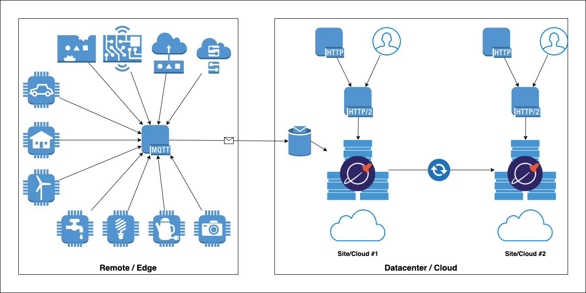


I presented about IoT sensor data at the recently concluded [Distribute SQL Summit - Asia 2022 (DSS Asia 2022)][event-site]. IoT data is unique in some sense, so I started learning about its lifecycle. Its fascinating! imagine millions of machine coming together and talking to each other to support our daily lives. In many ways they substitute human senses. I have only scratched the surface though.

Starting in this space like, most of the tech spaces, can be complicated. So, I presented about my learnings and seeking feedback from fellow "travelers".

Here is a full video of my session ([link][talk-video]). Deck and Code for the presentation is over at [github][talk-repo]. Please provide your comments on this post, twitter, etc. I am also playing with ESP32, Pico PIs currently so I guess there is a good chance of an update on this.



## Links

- [Git Repository][talk-repo]
- [Slick Deck][talk-deck]
- [DSS Asia 2022 - Fun with Sensors][talk-video]
- [DSS Asia 2022 - Full On Demand Videos][event-video-playlist]

[event-video-playlist]: https://www.youtube.com/playlist?list=PL8Z3vt4qJTkLHN2fMG6l5QN01_XIjo_eM
[event-site]: https://asia.distributedsql.org/
[talk-video]: https://www.youtube.com/watch?v=bmB49FrqEwY&list=PL8Z3vt4qJTkLHN2fMG6l5QN01_XIjo_eM&index=15
[talk-repo]: https://github.com/yogendra/fun-with-sensors-data
[talk-deck]: https://github.com/yogendra/fun-with-sensors-data/blob/main/slides.pdf
