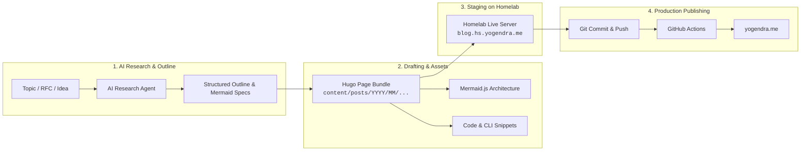
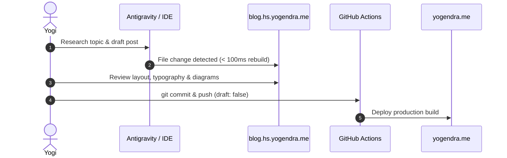

Technical blogging often comes with high cognitive friction: synthesizing deep research, formatting code blocks, hand-crafting architecture diagrams, and verifying layout fidelity across devices before hitting publish.

By pairing an **AI pair-programmer/researcher** with a **private Homelab staging environment**, we can turn rough ideas into well-structured, illustrated technical articles in minutes.

---

## The Workflow Architecture

Here is how the end-to-end publishing pipeline is organized:



---

## 1. Creating the Post Bundle

Using go-task, initialize a new Hugo page bundle:

```bash
task post:create -- "AI-Assisted Blogging on Homelab"
```

This creates a self-contained folder under `content/posts/2026/08/ai-assisted-blogging-on-homelab/` containing `index.md` and any local assets.

---

## 2. Dynamic Live Staging

The homelab staging server runs in Docker behind Traefik v3 and Authelia SSO:

```yaml
# homelab/blog/docker-compose.yml
services:
  blog-preview:
    image: hugomods/hugo:exts
    container_name: blog-preview
    user: "1000:1000"
    command: >
      hugo server
      --bind=0.0.0.0
      --port=1313
      --baseURL=https://blog.hs.yogendra.me
      --appendPort=false
      --liveReloadPort=443
      --buildDrafts
      --watch
      --poll 700ms
    volumes:
      - /home/yogi/projects/yogendra.me-v2:/src
```

Whenever any markdown file or image in the workspace changes, Hugo automatically rebuilds in under 100ms and updates the live browser session at `https://blog.hs.yogendra.me`.

---

## 3. Protocol Flow Example



---

## Summary & Next Steps

With this pipeline:
- **Research & Outlining**: Accelerated by AI prompts and structured briefs.
- **Visuals**: Seamless Mermaid diagrams rendered natively by the Hugo Clarity theme.
- **Staging**: Instant feedback at `https://blog.hs.yogendra.me` protected by Authelia SSO.
- **Verification**: Automated beta quality checks on Cloudflare Pages before production rollout.
- **Publishing**: Clean, automated CI/CD directly to `yogendra.me`.
