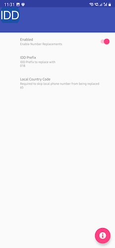

[][google-play-link]

IDD Dialer v2 is a rewrite of now defunct v1. Core function is same. It is a simple utility application for Android. It simplifies usage of IDD service, Calling Cards, etc.

Most of the times, using these services requires you to either put custom numbers in your address book or copy-paste-edit phone numbers. Example, if you want to dial `+911234567890`, and idd service needs you to put `018`. So, you are expected to dial `018911234567890`.

You could store the number as expected by the service provider, in address book. But when you change service, well good luck updating all the numbers. Other option is to copy-paste numbers on dialer screen and prefix with whatever you need to.

This is _unacceptable_ in 2018. So, I made this app to just replace the phone number on-the-fly. No more storing custom prefixed numbers.
This application replaces `+` in the your outgoing number with another prefix.

## How does it work?

This app replaces `+` in the outgoing calls with the **prefix** that you supplied in the settings. It will skip this replacement for any number that starts with your local ISD code. So if you are in Singapore and using StarHub IDD service, you may have following settings (See image):

> - Enabled: Yes
> - Prefix: 018
> - Local ISD Code: 65

## Step By Step

## What Next?

Full source code is available on [Github](https://github.com/yogendra/idd). Post your feedback here in comments.

[][google-play-link]

[Terms & Conditions][tnc] | [Privacy Policy][privacy-policy]

[download]: https://drive.google.com/file/d/15IO80cdZgxTb1HsYO51fbB701CWSXE_K/view
[number-replace-image]: number-replace-image.png
[icon]: app-icon.png
[example-starhub]: example-starhub.png
[privacy-policy]: privacy
[tnc]: tnc
[google-play-link]: https://play.google.com/store/apps/details?id=me.yogendra.iddv2
